# How I Integrated Lingo.dev Deeply Into Polyform (Not Just Translation, But the Core Realtime Editing Loop)

> A very detailed, Hashnode-ready technical deep dive written from my point of view, with most of the focus on how I wired Lingo.dev into a realtime collaborative app.

## Table of contents

1. [Why I made Lingo.dev a core system dependency](#why-i-made-lingodev-a-core-system-dependency)
2. [The architecture decision that made everything else easier](#the-architecture-decision-that-made-everything-else-easier)
3. [Where Lingo.dev actually sits in my app](#where-lingodev-actually-sits-in-my-app)
4. [The content translation pipeline (the main integration)](#the-content-translation-pipeline-the-main-integration)
5. [Client side orchestration in the workspace](#client-side-orchestration-in-the-workspace)
6. [Server side Lingo.dev translation route design](#server-side-lingodev-translation-route-design)
7. [Cache design and why I hash the payload](#cache-design-and-why-i-hash-the-payload)
8. [Realtime fanout and stale translation suppression](#realtime-fanout-and-stale-translation-suppression)
9. [Race conditions I explicitly designed for](#race-conditions-i-explicitly-designed-for)
10. [UI localization with `localizeObject`](#ui-localization-with-localizeobject)
11. [Polly draft generation plus Lingo.dev post translation](#polly-draft-generation-plus-lingodev-post-translation)
12. [Performance model, equations, and scaling intuition](#performance-model-equations-and-scaling-intuition)
13. [What I would improve next](#what-i-would-improve-next)
14. [Hashnode diagram and equation patterns I used in this post](#hashnode-diagram-and-equation-patterns-i-used-in-this-post)
15. [Appendix G: `/api/translate` full execution trace](#appendix-g-apitranslate-full-execution-trace-lingodev-core-route-step-by-step)
16. [Appendix H: Workspace client and Lingo.dev orchestration](#appendix-h-workspace-client-and-lingodev-orchestration-detailed-event-level-model)
17. [Appendix I: Supabase realtime protocol details](#appendix-i-supabase-realtime-protocol-details-that-make-the-lingodev-integration-work)
18. [Appendix J: Cache stampede and concurrency control options](#appendix-j-cache-stampede-duplicate-misses-and-concurrency-control-options-for-the-lingodev-route)
19. [Appendix K: Security and deployment hardening](#appendix-k-security-abuse-prevention-and-deployment-hardening-for-the-lingodev-integration)
20. [Appendix L: Why I chose three different Lingo.dev methods](#appendix-l-why-i-chose-three-different-lingodev-methods-localizestringarray-localizeobject-localizetext-and-how-i-reason-about-each-one)
21. [Appendix M: Benchmarking and load-testing](#appendix-m-benchmarking-and-load-testing-the-lingodev-integration-what-i-would-measure-how-i-would-run-it)
22. [Appendix N: Troubleshooting playbook](#appendix-n-troubleshooting-playbook-for-the-lingodev-integration-symptom-to-root-cause)
23. [Appendix O: Design extensions I would build next](#appendix-o-design-extensions-i-would-build-next-while-keeping-the-same-lingodev-core)

## Why I made Lingo.dev a core system dependency

When I started building Polyform, I did not want translation to be a decorative feature sitting on the edge of the app.

I wanted it to be part of the actual collaboration loop.

That sounds small at first, but it changes almost every engineering decision:

- How I store source content
- How I version edits
- How I avoid stale UI in realtime sessions
- How I compute cache keys
- How I decide when to fan out translation results over realtime channels
- How I keep the interface localized without duplicating i18n logic everywhere

In other words, I did not integrate Lingo.dev at the end. I designed the app so Lingo.dev could sit in the center of the multilingual path.

This post is about that integration in detail.

I am going to focus mostly on the Lingo.dev content translation path, because that is where the most interesting architecture work lives. I will also cover the UI localization path and the Polly drafting path because they reuse the same Lingo.dev backbone in a clean way.

## The architecture decision that made everything else easier

The most important decision in this app is this:

**I keep one canonical source document, then derive translated views from it.**

I do not let each language become its own editable source of truth.

That single decision is why the Lingo.dev integration remains manageable under live edits.

### Source first mental model

- Every block has a `source_language`
- Every block has a `translation_version`
- Collaborators edit the source content
- Translations are derived, versioned, and treated as disposable views
- If a translation is stale, I show source content until a fresh translation arrives

This gives me a strong correctness rule:

$$
\text{display translated content only if } v_{translated} \ge v_{block}
$$

In my workspace code, this is implemented directly in the display path. If the translation is missing or older than the block version, the UI falls back to source content.

That is one of the most important details in the entire integration.

### Why this matters for Lingo.dev specifically

Lingo.dev is excellent for translation and localization, but the app still needs to answer hard product questions:

- What happens while a new translation is in flight?
- What if two edits happen quickly?
- What if one collaborator sees a stale translation packet after a newer source update?

The app answers those questions with versioning, and Lingo.dev becomes a predictable translation engine inside that model.

## Where Lingo.dev actually sits in my app

In Polyform, Lingo.dev is used in three distinct server routes:

1. `app/api/translate/route.ts` for document content translation using `localizeStringArray(...)`
2. `app/api/ui-localize/route.ts` for UI copy localization using `localizeObject(...)`
3. `app/api/polly/route.ts` for translating AI generated drafts using `localizeText(...)`

The first one is the core path. The other two prove that the same Lingo.dev engine can support both product UI and AI output without creating three separate localization systems.

### High level Lingo.dev integration map

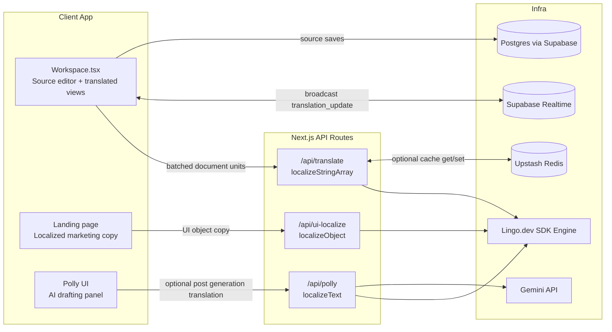
```mermaid
flowchart LR
  subgraph Client[Client App]
    W["Workspace.tsx<br/>Source editor + translated views"]
    L["Landing page<br/>Localized marketing copy"]
    P["Polly UI<br/>AI drafting panel"]
  end

  subgraph Server[Next.js API Routes]
    T["/api/translate<br/>localizeStringArray"]
    U["/api/ui-localize<br/>localizeObject"]
    Y["/api/polly<br/>localizeText"]
  end

  subgraph Infra[Infra]
    R[(Upstash Redis)]
    S[(Supabase Realtime)]
    DB[(Postgres via Supabase)]
    LG[Lingo.dev SDK Engine]
    G[Gemini API]
  end

  W -->|batched document units| T
  L -->|UI object copy| U
  P -->|optional post generation translation| Y

  T --> LG
  U --> LG
  Y --> LG
  Y --> G

  T <-->|optional cache get/set| R
  W <-->|broadcast translation_update| S
  W -->|source saves| DB
```

### Why I split the integration this way

I split by payload shape and product intent, not by language.

- `localizeStringArray` is great for ordered document units because index mapping stays deterministic
- `localizeObject` is perfect for nested UI copy objects because the shape is preserved
- `localizeText` fits freeform AI output after generation

This is one of the cleanest parts of the design. I am using the same Lingo.dev SDK engine type, but I am picking the Lingo.dev method that matches the structure of the content I am translating.

## The content translation pipeline (the main integration)

This is the path that matters most in production behavior.

When a user edits a document block, the app needs to do all of this without breaking the live experience:

- Update source content immediately
- Increment a version number immediately
- Broadcast source changes to collaborators immediately
- Save to the database shortly after
- Trigger translation after a short debounce
- Call Lingo.dev for each active target language
- Store results locally keyed by block and language
- Broadcast translated units so other viewers can render the new localized content
- Ignore stale translations if a newer source version already exists

That is a lot of moving parts, which is why I treat the Lingo.dev integration as a system design problem, not just an API call.

### End to end sequence for a source edit

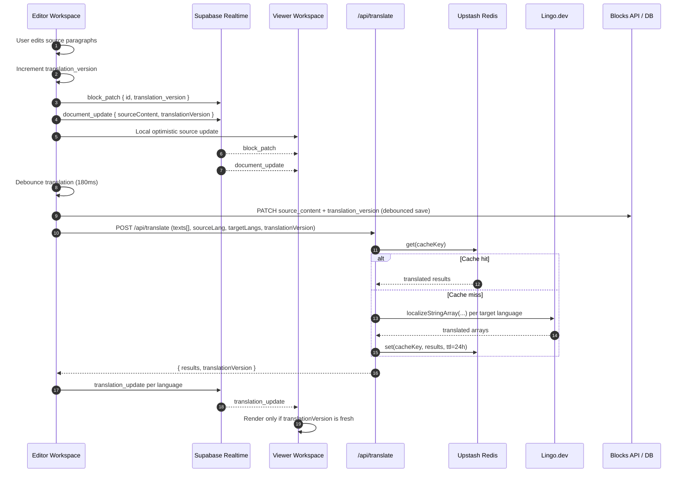
```mermaid
sequenceDiagram
  autonumber
  participant E as Editor Workspace
  participant RT as Supabase Realtime
  participant V as Viewer Workspace
  participant API as /api/translate
  participant Cache as Upstash Redis
  participant Lingo as Lingo.dev
  participant DB as Blocks API / DB

  E->>E: User edits source paragraphs
  E->>E: Increment translation_version
  E->>RT: block_patch { id, translation_version }
  E->>RT: document_update { sourceContent, translationVersion }
  E->>V: Local optimistic source update
  RT-->>V: block_patch
  RT-->>V: document_update
  E->>E: Debounce translation (180ms)
  E->>DB: PATCH source_content + translation_version (debounced save)
  E->>API: POST /api/translate (texts[], sourceLang, targetLangs, translationVersion)
  API->>Cache: get(cacheKey)
  alt Cache hit
    Cache-->>API: translated results
  else Cache miss
    API->>Lingo: localizeStringArray(...) per target language
    Lingo-->>API: translated arrays
    API->>Cache: set(cacheKey, results, ttl=24h)
  end
  API-->>E: { results, translationVersion }
  E->>RT: translation_update per language
  RT-->>V: translation_update
  V->>V: Render only if translationVersion is fresh
```

### The data model that makes the pipeline stable

At the center of this flow is `translation_version`.

I treat `translation_version` as the synchronization key between:

- the source content in the block
- the in memory translated variants in each client
- the translation responses from `/api/translate`
- the realtime `translation_update` packets

This gives me a simple but powerful invariant:

$$
\forall\; (b, \ell),\; \text{render}(b, \ell)=
\begin{cases}
\text{translated}(b,\ell) & \text{if } v_t \ge v_b \\
\text{source}(b) & \text{otherwise}
\end{cases}
$$

Where:

- \(b\) is the block
- \(\ell\) is the viewer language
- \(v_t\) is the translation version stored for that block and language
- \(v_b\) is the current block translation version

This is the reason late packets do not corrupt the UI.

## Client side orchestration in the workspace

Most of the Lingo.dev integration logic is shaped from the client side, even though the actual Lingo.dev calls happen server side.

The client decides:

- what to translate
- when to translate
- which target languages are worth translating right now
- how to store the results
- when to broadcast translations to other clients
- when to ignore old data

### 1) Target language selection is driven by active session presence

In `components/space/workspace.tsx`, I compute `targetLanguages` from the local user language plus the languages reported in presence events.

That means I do not blindly translate into every supported locale on every keystroke. I translate for the active audience.

This is a very important cost and latency optimization.

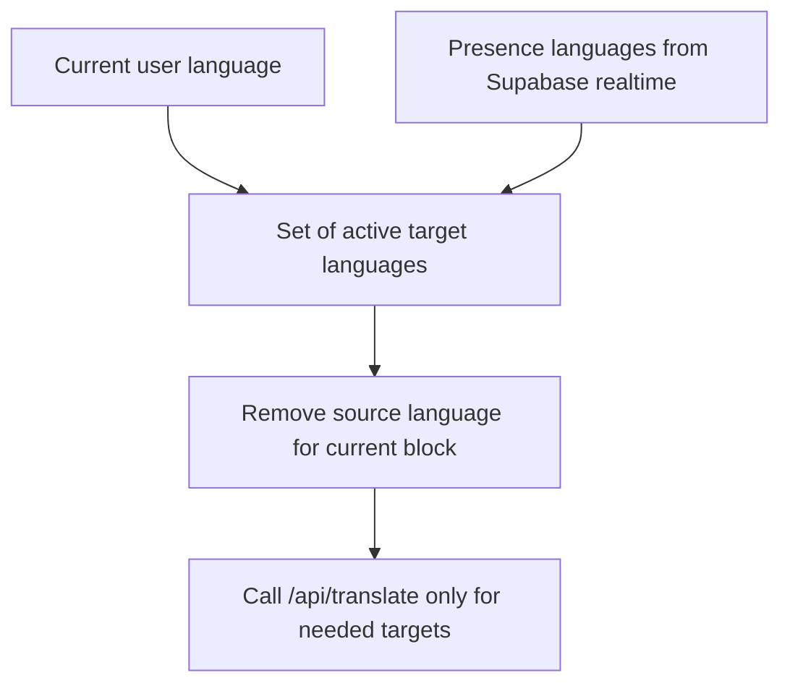
```mermaid
flowchart TD
  A[Current user language] --> C[Set of active target languages]
  B[Presence languages from Supabase realtime] --> C
  C --> D[Remove source language for current block]
  D --> E[Call /api/translate only for needed targets]
```

If nobody in the room is reading Japanese right now, I do not need to call Lingo.dev for Japanese during that edit burst.

### 2) Translation work is triggered after source updates, not before

When I update a block, I do this in order:

1. Increment the block `translation_version`
2. Update local source state immediately
3. Broadcast source change metadata and source content over realtime
4. Schedule translation with a short debounce
5. Persist to the database with a slightly larger debounce

That ordering keeps the editing experience snappy and ensures translations are derived from an already versioned source snapshot.

### 3) The translation trigger has fast exit guards

Before making any Lingo.dev request, the client checks several guard conditions.

The client skips translation if:

- the block is `universal`
- no translatable units are extracted
- there are no target languages after filtering out the source language
- a translation request is already pending for that block
- a fresh enough translation already exists for the active viewer language

Those small checks reduce load and prevent request storms.

### Client side translation trigger flow (`runTranslation`)

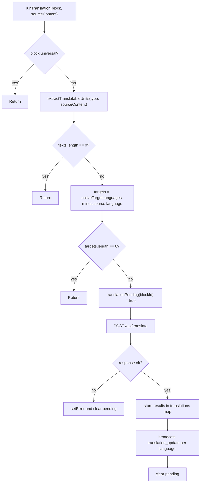
```mermaid
flowchart TD
  A["runTranslation(block, sourceContent)"] --> B{"block.universal?"}
  B -- yes --> Z1[Return]
  B -- no --> C["extractTranslatableUnits(type, sourceContent)"]
  C --> D{"texts.length == 0?"}
  D -- yes --> Z2[Return]
  D -- no --> E["targets = activeTargetLanguages minus source language"]
  E --> F{"targets.length == 0?"}
  F -- yes --> Z3[Return]
  F -- no --> G["translationPending[blockId] = true"]
  G --> H["POST /api/translate"]
  H --> I{"response ok?"}
  I -- no --> J[setError and clear pending]
  I -- yes --> K[store results in translations map]
  K --> L[broadcast translation_update per language]
  L --> M[clear pending]
```

## Server side Lingo.dev translation route design

The server route in `app/api/translate/route.ts` is where the actual `LingoDotDevEngine` integration lives.

I designed this route to do five jobs well:

1. Validate inputs strictly
2. Build a deterministic cache key
3. Return cached results if available
4. Call Lingo.dev in a controlled way if not cached
5. Return normalized results with the original `translationVersion`

### Request contract (validated with Zod)

The route validates a payload with these fields:

- `spaceId: string`
- `blockId: string`
- `texts: string[]`
- `sourceLang: string`
- `targetLangs: string[]`
- `translationVersion: number`

I specifically include `translationVersion` in the request and response payload because the client needs it for stale suppression logic.

If validation fails, the route returns HTTP `400` with Zod error details.

If runtime execution fails, it returns HTTP `500` with the error message.

This split matters in production because it lets me quickly distinguish client contract bugs from service failures.

### Why I use a singleton Lingo.dev engine instance per server runtime

In each Lingo-backed route, I keep a module level `lingoEngine` and lazily initialize it:

- `let lingoEngine: LingoDotDevEngine | null = null`
- create it on first use with `new LingoDotDevEngine({ apiKey })`
- reuse it for subsequent requests in the same runtime instance

This is a practical choice that keeps the route code simple and avoids re-instantiating the engine on every request within the same server process lifecycle.

It also makes all three Lingo.dev routes follow the same pattern, which reduces maintenance friction.

## Cache design and why I hash the payload

I added an optional translation cache in `lib/translation/cache.ts` using Upstash Redis.

This cache is intentionally simple:

- If Upstash credentials are missing, the cache layer becomes a no-op and the app still works
- If credentials exist, the route uses Redis `get` and `set`
- Cached entries live for 24 hours (`ex = 60 * 60 * 24`)

This is the right kind of optional dependency design for a hackathon style app that still wants production behavior.

### How the cache key is built

In `/api/translate`, I build a cache key from:

- `spaceId`
- `blockId`
- `translationVersion`
- `sourceLang`
- a SHA-1 digest of the sorted target languages
- a SHA-1 digest of the joined text array

Conceptually:

$$
K = \text{translation:}\;spaceId\;:\;blockId\;:\;v\;:\;src\;:\;H(T)\;:\;H(X)
$$

Where:

- \(T\) is the sorted list of target languages
- \(X\) is the ordered list of source text units
- \(H\) is SHA-1 in the current implementation

Two implementation details here are easy to miss and very useful:

### 1) I sort `targetLangs` before hashing

This normalizes equivalent requests.

Without sorting, these would create different cache keys even though they are semantically identical:

- `["fr", "de"]`
- `["de", "fr"]`

Sorting makes the cache stable against ordering differences from the client.

### 2) I include `translationVersion` in the key

This keeps cached translations tied to a specific source version.

That means a translation for version 12 can never be accidentally reused for version 13, even if the block id and target languages are the same.

This is exactly what I want in a realtime editor.

### Cache hit and miss behavior

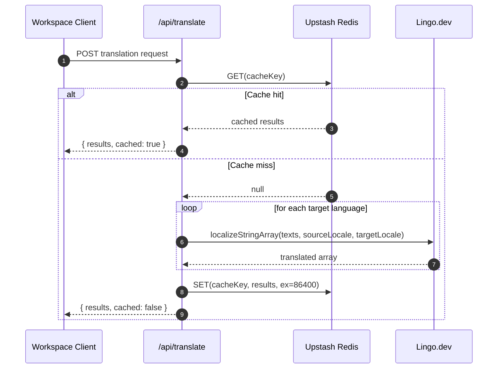
```mermaid
sequenceDiagram
  autonumber
  participant C as Workspace Client
  participant API as /api/translate
  participant R as Upstash Redis
  participant L as Lingo.dev

  C->>API: POST translation request
  API->>R: GET(cacheKey)
  alt Cache hit
    R-->>API: cached results
    API-->>C: { results, cached: true }
  else Cache miss
    R-->>API: null
    loop for each target language
      API->>L: localizeStringArray(texts, sourceLocale, targetLocale)
      L-->>API: translated array
    end
    API->>R: SET(cacheKey, results, ex=86400)
    API-->>C: { results, cached: false }
  end
```

### Why I cache translated arrays instead of reconstructed content objects

The client stores and broadcasts translated **units** (`string[]`) and reconstructs the display content using `applyTranslatedUnits(...)`.

I prefer this because:

- the cache payload is small and uniform
- the server route stays generic for a given unit extraction strategy
- the client can rehydrate into the current block content shape while preserving formatting metadata

This design is visible in `components/blocks/translation-utils.ts`, where the current document block extractor reads `paragraphs[]`, and the apply function puts translated paragraphs back into the content object.

## Realtime fanout and stale translation suppression

The Lingo.dev request is not the end of the workflow.

The part that actually makes the experience feel multilingual in realtime is what happens **after** the translation response comes back.

### What the client does with `/api/translate` results

After `runTranslation` receives `results: Record<string, string[]>`, the workspace client:

1. Stores each translated array in local state under `translations[blockId][langCode]`
2. Attaches the current `translationVersion` to each stored translation
3. Broadcasts a `translation_update` event for each language through `SupabaseRoomClient`

The event payload includes:

- `blockId`
- `translationVersion`
- `language`
- `texts[]`

That payload shape is exactly what another client needs to update its translated view state without waiting for a new server fetch.

### Realtime event topology for translated content

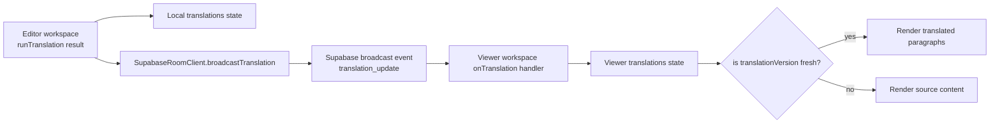
```mermaid
flowchart LR
  A["Editor workspace<br/>runTranslation result"] --> B["Local translations state"]
  A --> C[SupabaseRoomClient.broadcastTranslation]
  C --> D["Supabase broadcast event<br/>translation_update"]
  D --> E[Viewer workspace onTranslation handler]
  E --> F[Viewer translations state]
  F --> G{is translationVersion fresh?}
  G -- yes --> H[Render translated paragraphs]
  G -- no --> I[Render source content]
```

### Why I broadcast translations from the client instead of the server route

I chose client side fanout here because the editor client already has the request context and receives the response first.

That keeps the `/api/translate` route focused on translation and caching, not room membership or realtime transport concerns.

There are tradeoffs, but for this architecture it is a good separation:

- `/api/translate` owns Lingo.dev calls and cache behavior
- `workspace.tsx` owns UI state and collaboration fanout
- `SupabaseRoomClient` owns the broadcast transport details

### The stale suppression logic is the real safety mechanism

In the display path, the workspace checks whether a translation exists and whether its version is new enough.

If not, it renders the source content.

This is the difference between:

- a multilingual UI that is eventually inconsistent
- a multilingual UI that is correct under out of order packets

### Staleness state machine

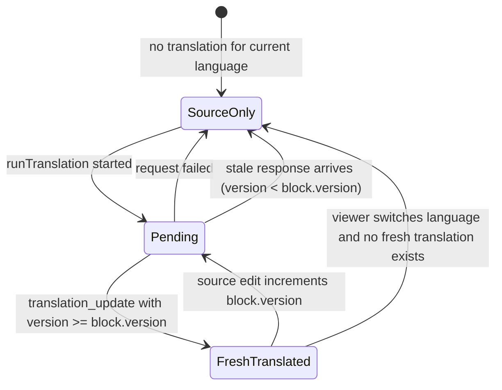
```mermaid
stateDiagram-v2
  [*] --> SourceOnly: no translation for current language
  SourceOnly --> Pending: runTranslation started
  Pending --> FreshTranslated: translation_update with version >= block.version
  Pending --> SourceOnly: request failed
  FreshTranslated --> Pending: source edit increments block.version
  FreshTranslated --> SourceOnly: viewer switches language and no fresh translation exists
  Pending --> SourceOnly: stale response arrives (version < block.version)
```

## Race conditions I explicitly designed for

Realtime multilingual editing creates more race conditions than a normal document editor.

Lingo.dev gives me reliable translation primitives, but I still have to orchestrate the flow safely.

Here are the main races I planned for.

### Race 1: Source edits outpace translation responses

This is the most common race.

A user types quickly. The app increments `translation_version` multiple times. A translation response for an older version arrives after a newer source version already exists.

If I rendered that old translation, the UI would flicker backward.

I avoid that by storing versioned translations and applying the freshness check during render.

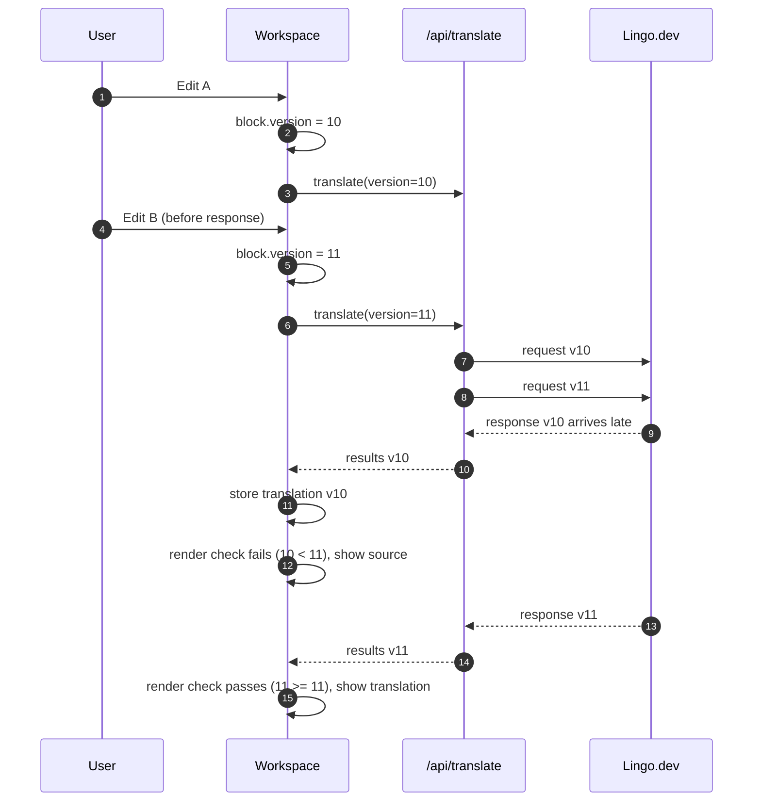
```mermaid
sequenceDiagram
  autonumber
  participant U as User
  participant W as Workspace
  participant API as /api/translate
  participant L as Lingo.dev

  U->>W: Edit A
  W->>W: block.version = 10
  W->>API: translate(version=10)
  U->>W: Edit B (before response)
  W->>W: block.version = 11
  W->>API: translate(version=11)
  API->>L: request v10
  API->>L: request v11
  L-->>API: response v10 arrives late
  API-->>W: results v10
  W->>W: store translation v10
  W->>W: render check fails (10 < 11), show source
  L-->>API: response v11
  API-->>W: results v11
  W->>W: render check passes (11 >= 11), show translation
```

### Race 2: Duplicate translation triggers during active viewing

The workspace has an effect that auto triggers translation when the user is viewing a non source language and the active block lacks a fresh translation.

Without protection, this could overlap with a manual or scheduled translation trigger.

I prevent overlap with `translationPending[block.id]`.

That per block pending flag is a small detail that avoids a lot of accidental duplicate traffic.

### Race 3: Presence language churn changes target sets mid session

Target languages are derived from active presence plus the local language.

That means the target set can change as collaborators join, leave, or switch their language.

I accept this dynamic behavior and keep the contract simple:

- each translation request uses the target set known at request time
- future edits will translate to whatever languages are active then
- clients still fall back safely if a translation for the new active language is not ready yet

This is a good tradeoff for a realtime collaboration product.

### Race 4: Cache key collisions from target order differences

I already mentioned this, but it is worth calling out as a race and correctness issue. If target arrays are not normalized, two equivalent requests can miss cache and create redundant Lingo.dev calls.

Sorting `targetLangs` before hashing closes that hole.

## Client side state model for multilingual rendering

I think it helps to visualize the in memory state shape because it explains why the integration remains predictable.

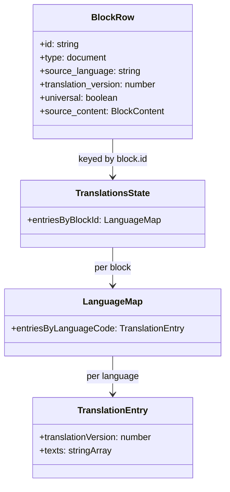
```mermaid
classDiagram
  class BlockRow {
    +id: string
    +type: document
    +source_language: string
    +translation_version: number
    +universal: boolean
    +source_content: BlockContent
  }

  class TranslationEntry {
    +translationVersion: number
    +texts: stringArray
  }

  class TranslationsState {
    +entriesByBlockId: LanguageMap
  }

  class LanguageMap {
    +entriesByLanguageCode: TranslationEntry
  }

  BlockRow --> TranslationsState : keyed by block.id
  TranslationsState --> LanguageMap : per block
  LanguageMap --> TranslationEntry : per language
```

### The rendering function is intentionally strict

The `displayContent(block)` logic effectively does this:

1. Start from the source content currently known for that block
2. If viewer language equals source language, return source
3. If block is universal, return source
4. Look up translation by `blockId` and `language`
5. If missing or stale, return source
6. If fresh, apply translated units back into the source content shape and render it

I like this because it makes correctness obvious. The translated view is always a derived overlay, never a replacement source of truth.

## How the document payload is translated with index stability

The current block type is `document` and the translation utilities are intentionally small:

- `extractTranslatableUnits("document", content)` returns `paragraphs[]`
- `applyTranslatedUnits("document", content, translated)` returns a new content object with translated `paragraphs`

That gives me index stable mapping between source paragraphs and translated paragraphs.

If the source paragraphs are:

1. Intro
2. Body
3. Summary

Then the translated array preserves the same positional structure:

1. Intro (translated)
2. Body (translated)
3. Summary (translated)

This is exactly why `localizeStringArray(...)` is such a good fit here.

### Unit mapping diagram

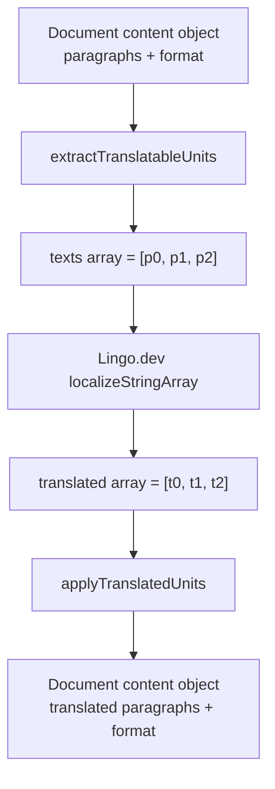
```mermaid
flowchart TB
  A["Document content object<br/>paragraphs + format"] --> B[extractTranslatableUnits]
  B --> C["texts array = [p0, p1, p2]"]
  C --> D[Lingo.dev localizeStringArray]
  D --> E["translated array = [t0, t1, t2]"]
  E --> F[applyTranslatedUnits]
  F --> G["Document content object<br/>translated paragraphs + format"]
```

This pattern will scale to more block types later, as long as I define extract and apply functions that preserve structure semantics.

## Timing design: debounce, persist, and translation request cadence

In the workspace, I use two different timing windows:

- Translation debounce: `180ms`
- Save debounce: `450ms`

This spacing is subtle but helpful.

It lets me translate sooner than I persist, which improves the perceived collaboration speed for multilingual viewers while still reducing database write frequency.

### Timing diagram for a burst of edits

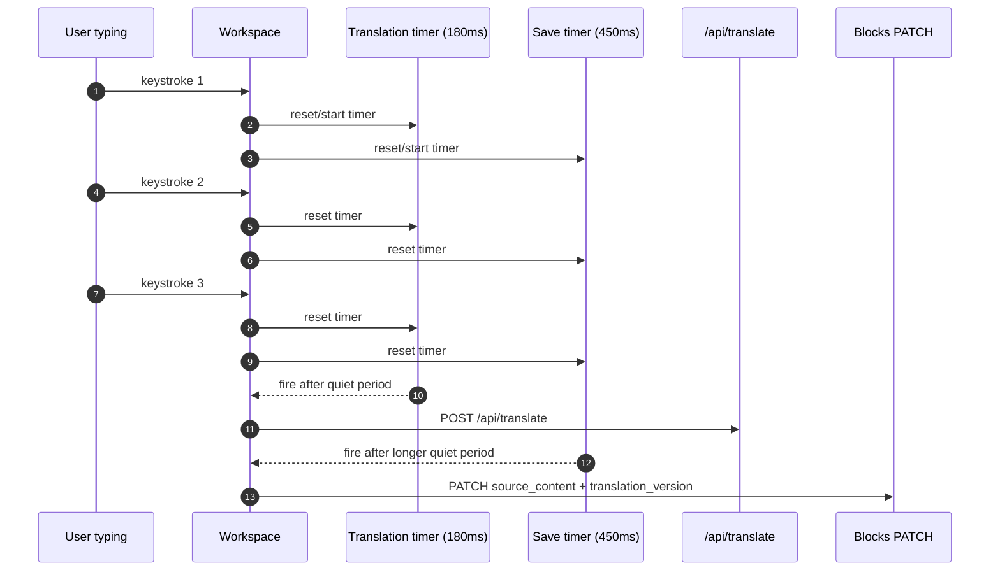
```mermaid
sequenceDiagram
  autonumber
  participant U as User typing
  participant W as Workspace
  participant T as Translation timer (180ms)
  participant S as Save timer (450ms)
  participant API as /api/translate
  participant DB as Blocks PATCH

  U->>W: keystroke 1
  W->>T: reset/start timer
  W->>S: reset/start timer
  U->>W: keystroke 2
  W->>T: reset timer
  W->>S: reset timer
  U->>W: keystroke 3
  W->>T: reset timer
  W->>S: reset timer
  T-->>W: fire after quiet period
  W->>API: POST /api/translate
  S-->>W: fire after longer quiet period
  W->>DB: PATCH source_content + translation_version
```

### A simple rate bound intuition

Let \(\Delta_t\) be the translation debounce window and \(\Delta_s\) be the save debounce window.

In a continuous burst with no quiet gap longer than \(\Delta_t\), translation requests are suppressed until the burst settles.

A rough upper bound on steady request frequency per block is:

$$
R_{translate} \lesssim \frac{1}{\Delta_t}
$$

With \(\Delta_t = 0.18s\), the theoretical upper bound is high, but real typing behavior and batching of paragraphs reduce actual request frequency significantly.

The more important point is not the exact number. The point is that debounce converts many keystrokes into fewer Lingo.dev calls.

## Server side error handling and fallbacks

I care a lot about how a system fails, especially when translation is in the core loop.

Here is what I like about the current design:

- Invalid payloads fail fast with `400`
- Runtime failures return `500`
- Missing Upstash config disables cache without breaking translation
- Translation failures do not corrupt source content
- The UI can continue rendering source content if translation is missing or stale

### Failure handling flow

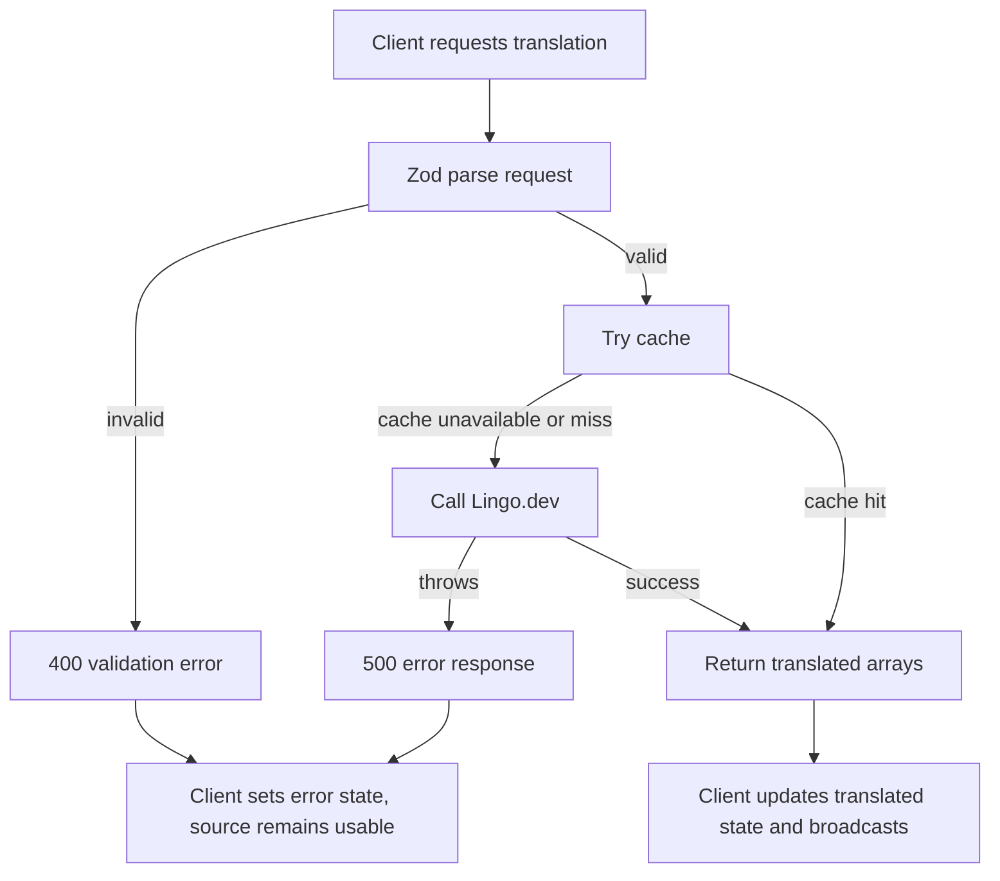
```mermaid
flowchart TD
  A[Client requests translation] --> B[Zod parse request]
  B -->|invalid| C[400 validation error]
  B -->|valid| D[Try cache]
  D -->|cache unavailable or miss| E[Call Lingo.dev]
  E -->|throws| F[500 error response]
  E -->|success| G[Return translated arrays]
  D -->|cache hit| G
  C --> H[Client sets error state, source remains usable]
  F --> H
  G --> I[Client updates translated state and broadcasts]
```

This is a big reason I am comfortable making Lingo.dev central to the experience. The failure mode is graceful because source content remains canonical and renderable.

## UI localization with `localizeObject`

This is the part of the integration that made the app feel cohesive to me.

I did not want content translation to be multilingual while the product chrome stayed English only.

So I added a separate Lingo.dev route, `app/api/ui-localize/route.ts`, that localizes UI copy objects using `localizeObject(...)`.

### Why `localizeObject(...)` is the right primitive for UI copy

UI copy is naturally structured data:

- labels
- button text
- helper text
- modal copy
- CTA strings
- grouped strings for panels and cards

If I flatten that into arrays manually, I lose readability and make the call site harder to maintain.

With `localizeObject(...)`, I can send a copy object and preserve the shape when it comes back.

That means the consuming UI code can stay simple.

### `ui-localize` route behavior

The route does a few smart things:

- validates `{ targetLang, texts }` with Zod
- returns the original object immediately for English (`targetLang === "en"`)
- lazily initializes the same `LingoDotDevEngine` pattern
- calls `engine.localizeObject(input.texts, { sourceLocale: "en", targetLocale: input.targetLang })`

That English fast path matters more than it looks. It avoids unnecessary Lingo.dev calls for the default language and makes the route safe to call from generic client logic.

### Workspace UI localization flow

In `components/space/workspace.tsx`, I cache localized UI text per language in memory:

- `uiTextByLanguage` starts with English defaults
- when `language` changes and localized text is not present, the client fetches `/api/ui-localize`
- on success, it resolves the returned object into a strongly shaped `WorkspaceUiText`
- on failure, it falls back to the English defaults

This is a good example of an integration pattern I like:

- optimistic local defaults
- lazy localization fetch
- in-memory cache by language
- safe fallback on error

### UI localization sequence diagram

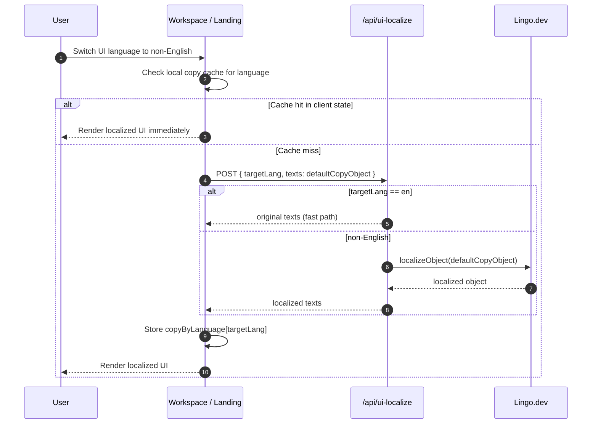
```mermaid
sequenceDiagram
  autonumber
  participant U as User
  participant W as Workspace / Landing
  participant API as /api/ui-localize
  participant L as Lingo.dev

  U->>W: Switch UI language to non-English
  W->>W: Check local copy cache for language
  alt Cache hit in client state
    W-->>U: Render localized UI immediately
  else Cache miss
    W->>API: POST { targetLang, texts: defaultCopyObject }
    alt targetLang == en
      API-->>W: original texts (fast path)
    else non-English
      API->>L: localizeObject(defaultCopyObject)
      L-->>API: localized object
      API-->>W: localized texts
    end
    W->>W: Store copyByLanguage[targetLang]
    W-->>U: Render localized UI
  end
```

### Why this matters for the main Lingo.dev story

I consider this part of the same integration story, not a separate feature.

The app uses Lingo.dev consistently across:

- content translation (document units)
- UI copy localization (structured objects)
- AI output translation (freeform text)

That consistency is what makes the architecture feel intentional.

## Polly draft generation plus Lingo.dev post translation

This path is a nice demonstration of using Lingo.dev after another model, not instead of another model.

In `app/api/polly/route.ts`, the pipeline is:

1. Parse the prompt and optional source text with Zod
2. Detect the target language from the prompt (via aliases)
3. Generate a draft in English with Gemini
4. If the target language is not English, translate the draft with Lingo.dev using `localizeText(...)`
5. Return the final draft plus metadata to the client

### Why I generate in English first, then translate with Lingo.dev

I do this on purpose.

It gives me a cleaner separation of concerns:

- Gemini handles drafting quality and structure
- Lingo.dev handles translation/localization of the final text

This usually produces a more predictable system than trying to make the generation model do everything in every language directly, especially in a fast moving product prototype.

### Polly plus Lingo.dev sequence

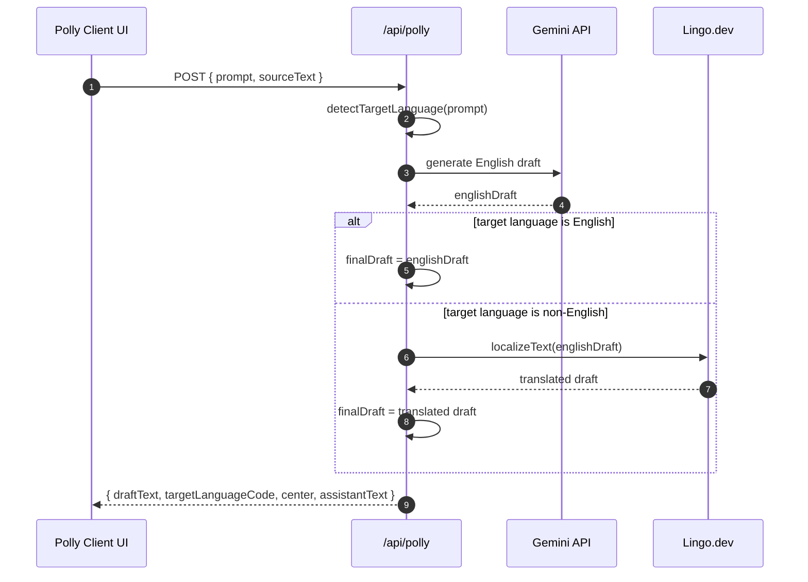
```mermaid
sequenceDiagram
  autonumber
  participant C as Polly Client UI
  participant API as /api/polly
  participant G as Gemini API
  participant L as Lingo.dev

  C->>API: POST { prompt, sourceText }
  API->>API: detectTargetLanguage(prompt)
  API->>G: generate English draft
  G-->>API: englishDraft
  alt target language is English
    API->>API: finalDraft = englishDraft
  else target language is non-English
    API->>L: localizeText(englishDraft)
    L-->>API: translated draft
    API->>API: finalDraft = translated draft
  end
  API-->>C: { draftText, targetLanguageCode, center, assistantText }
```

### Shared integration pattern across all three routes

All three Lingo.dev routes share these design patterns:

- lazy singleton `LingoDotDevEngine`
- environment driven API key resolution through `getLingoEnv()`
- Zod input validation
- explicit `sourceLocale` and `targetLocale`
- normalized error responses

This consistency is not just style. It reduces the chance that one route drifts into a completely different operational behavior.

## Performance model, equations, and scaling intuition

I want to be explicit here because performance conversations around translation often stay too vague.

In this app, Lingo.dev cost and latency are shaped mostly by three variables:

- number of translated units per request
- number of target languages requested
- cache hit rate

Let:

- \(n = |X|\) be the number of text units (`texts[]`)
- \(m = |T|\) be the number of target languages after filtering out the source language
- \(p_h\) be the cache hit probability for a translation request

### Number of Lingo.dev calls per content translation request

On a cache miss, the route calls `localizeStringArray(...)` once per target language.

So:

$$
N_{lingo\_calls} =
\begin{cases}
0 & \text{cache hit} \\
m & \text{cache miss}
\end{cases}
$$

Expected value:

$$
\mathbb{E}[N_{lingo\_calls}] = (1 - p_h) \cdot m
$$

This is why both the target language selection logic and the cache design are first class parts of the Lingo.dev integration.

### Translation work volume per request

A simple work proxy is the number of unit translations attempted:

$$
W \propto n \cdot m
$$

This is not a billing formula. It is a useful engineering intuition for why batching paragraphs and limiting target locales to active viewers matters.

### Latency model (high level)

Let:

- \(L_r\) = Redis lookup latency
- \(L_s\) = serialization and route overhead
- \(L_{lingo,i}\) = Lingo.dev latency for target language \(i\)

The route currently translates target languages with `Promise.all(...)`, so the Lingo portion on a miss is approximately bounded by the slowest target call, not the sum.

A practical approximation is:

$$
L_{miss} \approx L_r + L_s + \max_{i \in T}(L_{lingo,i})
$$

And the expected route latency is:

$$
\mathbb{E}[L] \approx p_h \cdot (L_r + L_s) + (1-p_h) \cdot L_{miss}
$$

This is one of the best parts of the current implementation. Using `Promise.all(...)` means adding a second target language does not necessarily double latency. It increases load, but user visible latency on the miss path is closer to the slowest target than the total sum.

### Realtime fanout message count per translation response

The workspace broadcasts one `translation_update` event per target language returned.

So the fanout count per translation response is:

$$
M_{rt} = m
$$

If I ever need to reduce message count, one possible optimization would be to broadcast a single packet containing all language results. Right now, the per-language event shape keeps the client handler simple and composable.

## Observability I would add around the Lingo.dev integration

If I were taking this from hackathon polish into heavier production traffic, I would add structured metrics around the Lingo.dev path first.

### Metrics that would immediately help

- translation API request count
- translation API error rate (`400` vs `500`)
- cache hit rate for `/api/translate`
- median and p95 Lingo.dev route latency
- per-target-language latency distribution
- average `texts[]` length per request
- average active target language count per room
- stale translation drops (responses stored but not rendered because version is old)

### A metrics flow sketch

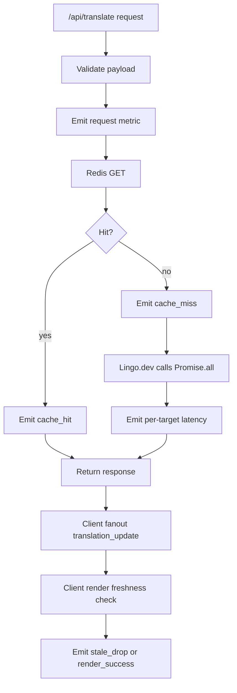
```mermaid
flowchart TD
  A["/api/translate request"] --> B[Validate payload]
  B --> C[Emit request metric]
  C --> D[Redis GET]
  D --> E{Hit?}
  E -- yes --> F[Emit cache_hit]
  E -- no --> G[Emit cache_miss]
  G --> H[Lingo.dev calls Promise.all]
  H --> I[Emit per-target latency]
  F --> J[Return response]
  I --> J
  J --> K[Client fanout translation_update]
  K --> L[Client render freshness check]
  L --> M[Emit stale_drop or render_success]
```

## What I would improve next

I am genuinely happy with the current Lingo.dev integration shape because it already has the right fundamentals: payload validation, caching, versioning, realtime fanout, and graceful fallback behavior.

That said, there are clear next steps.

### 1) Add request IDs for traceability across route, cache, and realtime

I would attach a request id to `/api/translate` responses and propagate it into translation broadcasts for easier debugging.

### 2) Add partial failure handling for multi target requests

Right now, a failure during one target language translation can fail the whole request depending on where the error happens.

A more fault tolerant version could return partial results plus per-language errors.

### 3) Add background retries for large documents or transient failures

For bigger blocks or noisy networks, a background retry queue could improve reliability while the UI keeps showing source content.

### 4) Expand translation unit extraction to more block types

The current translation utils are intentionally minimal for the `document` block type. I would extend this with explicit extract/apply adapters for headings, tables, lists, and maybe comments.

### 5) Add cache observability and invalidation tooling

A simple admin debug panel showing cache hit/miss and the generated cache key components would make performance tuning faster.

## The design choices that made Lingo.dev integration feel production-safe

If I had to summarize the parts that matter most, it would be this list:

- **Canonical source content** instead of per-language mutable sources
- **Versioned translations** with strict freshness checks at render time
- **Structure matched Lingo.dev methods** (`string[]`, object, text)
- **Optional caching** that improves performance without becoming a hard dependency
- **Realtime fanout after translation** so collaborators get localized updates quickly
- **Fast guard clauses** on the client to avoid unnecessary translation requests

I think that combination is what turns a translation feature into a multilingual collaboration system.

## Hashnode diagram and equation patterns I used in this post

You asked specifically for a Hashnode-ready post with serious diagrams and equations, so here is the exact pattern set I used throughout.

### Mermaid diagrams in Hashnode

Use fenced code blocks with `mermaid`:

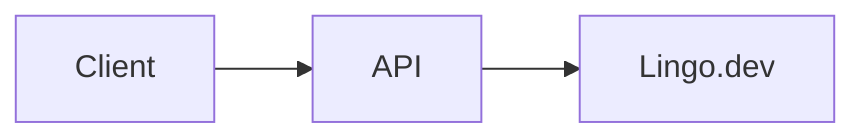
```mermaid
flowchart LR
  A[Client] --> B[API]
  B --> C[Lingo.dev]
```

Hashnode documents Mermaid as an advanced Markdown block, so this format is the correct one to paste directly.

### Inline equations in Hashnode

Use inline LaTeX wrapped like this: \(v_t \ge v_b\)

Example in sentence form:

I only render translated content when \(v_t \ge v_b\).

### Block equations in Hashnode

Use double dollar fences:

$$
\mathbb{E}[N_{lingo\_calls}] = (1 - p_h) \cdot m
$$

I included both inline and block math in this post so you can keep the technical reasoning clear without dropping into plain text approximations.

## Final thoughts from actually building it

The biggest thing I learned while integrating Lingo.dev into Polyform is that multilingual collaboration is mostly a systems problem.

The translation call itself is not the hard part.

The hard part is making sure translation behaves correctly inside a live editing loop where users type fast, presence changes dynamically, packets arrive out of order, and the UI still has to feel obvious and stable.

Lingo.dev made the translation layer clean enough that I could spend my engineering effort on the orchestration layer:

- batching
- versioning
- caching
- realtime propagation
- stale suppression
- structure preserving rehydration

That is exactly what I wanted.

If you are building a multilingual product and you want translation to be part of the product loop instead of a cosmetic afterthought, my advice is simple:

1. Make source content canonical.
2. Version everything that affects translation display.
3. Choose the Lingo.dev method that matches your payload shape.
4. Treat translation responses as derived state, not primary state.
5. Build fallbacks so the app remains correct even when translation is late.

That combination is what made this integration work for me.

## Appendix A: Technical diagrams for deeper reasoning (extra)

I wanted to include a few more diagrams that I personally use when sanity checking the architecture.

### Cache key composition diagram

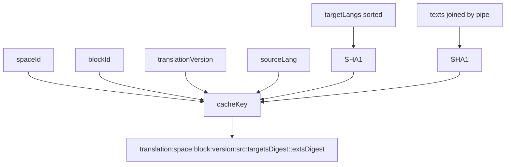
```mermaid
flowchart TB
  A[spaceId] --> K[cacheKey]
  B[blockId] --> K
  C[translationVersion] --> K
  D[sourceLang] --> K
  E[targetLangs sorted] --> F[SHA1]
  F --> K
  G[texts joined by pipe] --> H[SHA1]
  H --> K
  K --> R[translation:space:block:version:src:targetsDigest:textsDigest]
```

### Realtime event matrix

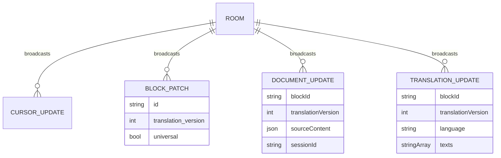
```mermaid
erDiagram
  ROOM ||--o{ CURSOR_UPDATE : broadcasts
  ROOM ||--o{ BLOCK_PATCH : broadcasts
  ROOM ||--o{ DOCUMENT_UPDATE : broadcasts
  ROOM ||--o{ TRANSLATION_UPDATE : broadcasts

  TRANSLATION_UPDATE {
    string blockId
    int translationVersion
    string language
    stringArray texts
  }

  DOCUMENT_UPDATE {
    string blockId
    int translationVersion
    json sourceContent
    string sessionId
  }

  BLOCK_PATCH {
    string id
    int translation_version
    bool universal
  }
```

### Multi-client multilingual convergence sketch

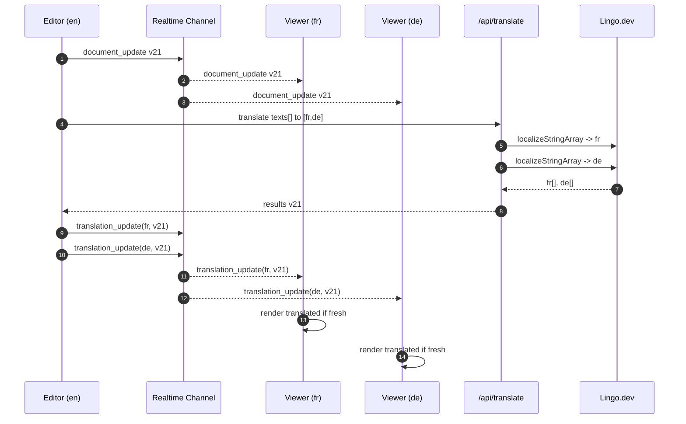
```mermaid
sequenceDiagram
  autonumber
  participant A as Editor (en)
  participant RT as Realtime Channel
  participant B as Viewer (fr)
  participant C as Viewer (de)
  participant API as /api/translate
  participant L as Lingo.dev

  A->>RT: document_update v21
  RT-->>B: document_update v21
  RT-->>C: document_update v21
  A->>API: translate texts[] to [fr,de]
  API->>L: localizeStringArray -> fr
  API->>L: localizeStringArray -> de
  L-->>API: fr[], de[]
  API-->>A: results v21
  A->>RT: translation_update(fr, v21)
  A->>RT: translation_update(de, v21)
  RT-->>B: translation_update(fr, v21)
  RT-->>C: translation_update(de, v21)
  B->>B: render translated if fresh
  C->>C: render translated if fresh
```

## Appendix B: Practical integration checklist I would follow again

If I were integrating Lingo.dev into another realtime app tomorrow, this is the checklist I would use.

- Define a canonical source representation first
- Add a translation version field to the content model
- Decide unit extraction and rehydration functions before writing API routes
- Validate translation payloads with Zod at the route boundary
- Include version metadata in both request and response
- Add optional cache with deterministic key normalization
- Derive target languages from active audience, not a giant fixed list
- Debounce translation independently from persistence
- Broadcast translated results as derived state over realtime
- Enforce freshness checks in the render path
- Keep English fast paths for UI localization routes
- Reuse the same Lingo.dev engine initialization pattern across routes
- Add metrics before traffic forces you to guess

If you want, I can also publish a follow up post that focuses only on the `translation_version` correctness model and race testing strategy, because that part is where most multilingual collaboration apps get subtle bugs.

## Appendix C: Annotated code walkthrough of the Lingo.dev integration (actual implementation patterns)

This section is for readers who want to map the architecture directly to code.

I am not copying the entire files here. I am pulling out the implementation patterns that make the integration work.

### 1) `/api/translate` request validation and versioned contract

The translation route validates a payload that includes `translationVersion`. That field is not optional in my design, because it is part of the correctness protocol between client and server.

```ts
const schema = z.object({
  spaceId: z.string().min(1),
  blockId: z.string().min(1),
  texts: z.array(z.string()).min(1),
  sourceLang: z.string().min(2),
  targetLangs: z.array(z.string()).min(1),
  translationVersion: z.number().int().positive(),
});
```

Why this matters:

- `texts` must be non-empty so I never call Lingo.dev for empty payloads
- `targetLangs` must be non-empty so request intent is explicit
- `translationVersion` must be a positive integer so the render freshness rule can stay simple

If you omit the version from the contract, you force the client to infer freshness through timing, which is fragile in realtime apps.

### 2) Lazy engine initialization with shared env resolution

The route uses a module level engine instance and resolves the API key with `getLingoEnv()`.

```ts
let lingoEngine: LingoDotDevEngine | null = null;

function getLingoEngine(): LingoDotDevEngine {
  if (lingoEngine) return lingoEngine;
  const env = getLingoEnv();
  lingoEngine = new LingoDotDevEngine({ apiKey: env.lingoApiKey });
  return lingoEngine;
}
```

I repeated this pattern in all Lingo.dev routes because it keeps the behavior consistent and easy to scan.

### 3) Cache key construction is intentionally version aware and order normalized

This is one of the most important sections in the route:

```ts
const textsDigest = createHash("sha1").update(input.texts.join("|"), "utf8").digest("hex");
const targetsDigest = createHash("sha1").update(input.targetLangs.sort().join(","), "utf8").digest("hex");
const cacheKey = `translation:${input.spaceId}:${input.blockId}:${input.translationVersion}:${input.sourceLang}:${targetsDigest}:${textsDigest}`;
```

I like this implementation for a few reasons:

- it keeps the final key readable at a glance
- it avoids storing very long raw payloads in the key
- it normalizes target language ordering before hashing
- it guarantees different source versions do not reuse old translations

If I were evolving this further, I might include a route version segment like `v1` in the key to support future schema changes more explicitly.

### 4) Parallel Lingo.dev calls on the miss path

On a cache miss, the route translates all requested target languages in parallel.

```ts
const entries = await Promise.all(
  input.targetLangs.map(async (targetLang) => {
    const translated = await engine.localizeStringArray(input.texts, {
      sourceLocale: input.sourceLang,
      targetLocale: targetLang,
    });

    const normalized = Array.isArray(translated) ? translated.map((value) => String(value)) : [];
    return [targetLang, normalized] as const;
  }),
);
```

Important detail:

I normalize the response to `string[]` explicitly. Even when I trust the SDK, I still like to normalize response values before they enter shared client state.

This reduces downstream type surprises and keeps the route response stable.

### 5) Client side translation request payload is deliberately compact

In `workspace.tsx`, the client sends only what the server needs for a deterministic translation response:

```ts
body: JSON.stringify({
  spaceId,
  blockId: block.id,
  texts,
  sourceLang: block.source_language,
  targetLangs: targets,
  translationVersion: block.translation_version,
}),
```

I do not send the entire block object. I do not send UI only metadata. I send the minimum translation contract.

That is good for performance, cache key determinism, and route clarity.

### 6) Translations are stored as derived state, not patched into source state

After the response comes back, I store translation results in a separate `translations` map keyed by block and language.

Conceptually, the update shape looks like this:

```ts
translations[blockId][langCode] = {
  translationVersion: block.translation_version,
  texts: translatedTexts,
};
```

This is the core reason the app can keep one canonical source while still rendering localized views per user.

### 7) Realtime broadcast payloads are small and versioned

When the editor client gets translation results, it broadcasts one `translation_update` per language:

```ts
roomClientRef.current.broadcastTranslation({
  blockId: block.id,
  translationVersion: block.translation_version,
  language: langCode,
  texts: translatedTexts,
});
```

That payload is exactly the minimum needed for other clients to update their derived translation state.

I do not broadcast cache metadata. I do not broadcast the entire block. I do not broadcast the source content again here.

This keeps the realtime channel focused.

### 8) Freshness checks happen at render time, not only when storing

I keep emphasizing this because it is where many realtime systems break.

Even if the client stores an older translation result, the render path still checks the version before displaying it.

That means stale packets can arrive and be safely ignored visually.

I prefer this design because it turns stale handling into a deterministic rendering rule instead of a timing guess.

## Appendix D: Testing and failure injection strategy for the Lingo.dev path

I would not call a multilingual collaboration loop production ready without testing the failure and race behavior.

The repo currently includes a focused test around translation unit extraction and rehydration, which is a good base. If I were extending the test suite, I would add the following.

### 1) Unit tests for translation route cache key normalization

Test cases I would write:

- same `texts[]`, same targets in different order -> same cache key
- same everything but different `translationVersion` -> different cache key
- same everything but changed paragraph text -> different cache key
- same everything but changed `sourceLang` -> different cache key

The key lesson is that cache correctness is part of translation correctness here.

### 2) Unit tests for client freshness logic

I would isolate and test the `displayContent` freshness behavior with cases like:

- translation missing -> source shown
- translation version lower than block version -> source shown
- translation version equal to block version -> translated shown
- translation version higher than block version (should not happen often, but possible from optimistic timing) -> translated shown under current rule

That last case is worth deciding intentionally. The current rule `>=` is a pragmatic choice for monotonic freshness.

### 3) Integration tests for `runTranslation` guard clauses

The client should not call `/api/translate` when:

- block is `universal`
- extracted units are empty
- all active target languages equal source language
- translation is already pending

These tests protect you from gradual regressions that increase Lingo.dev traffic over time.

### 4) Failure injection tests

I would simulate:

- `/api/translate` returning `500`
- slow response for version `N`
- faster response for version `N+1`
- missing Upstash credentials
- malformed payload causing `400`

The expected user facing behavior should remain stable:

- source content still renders
- editor still edits normally
- error state may appear, but no data corruption
- fresh translations replace source only when version checks pass

### Failure injection timeline example

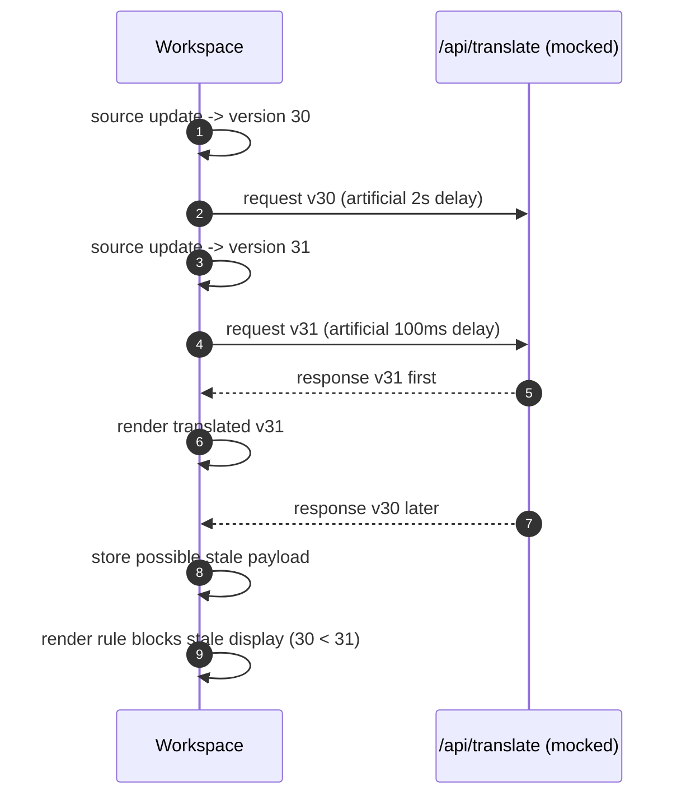
```mermaid
sequenceDiagram
  autonumber
  participant W as Workspace
  participant API as /api/translate (mocked)

  W->>W: source update -> version 30
  W->>API: request v30 (artificial 2s delay)
  W->>W: source update -> version 31
  W->>API: request v31 (artificial 100ms delay)
  API-->>W: response v31 first
  W->>W: render translated v31
  API-->>W: response v30 later
  W->>W: store possible stale payload
  W->>W: render rule blocks stale display (30 < 31)
```

### 5) Observability assisted debugging workflow

If a user reports "my translation looked old for a second," this is the debugging sequence I would follow:

1. Check client logs for `blockId`, current `translation_version`, and active language
2. Check `/api/translate` response timing and whether the response was cached
3. Inspect realtime `translation_update` payload version
4. Verify `displayContent` freshness comparison on the viewer client
5. Confirm whether the apparent issue was stale suppression fallback to source (expected) or incorrect translated render (bug)

This workflow is another reason I carry `translationVersion` through every layer. It makes debugging concrete.

## Appendix E: Small implementation choices that helped more than expected

These are minor details, but they improved the Lingo.dev integration a lot in practice.

### English fast path in `/api/ui-localize`

Returning the original copy object for English reduces unnecessary route work and keeps the client code simpler.

### Optional cache client creation

`lib/translation/cache.ts` returns `null` when Redis env vars are absent, which lets the app run locally without extra setup while preserving the same route behavior.

### Keeping translation payloads as arrays of strings

This made caching, broadcasting, and versioning much easier than trying to move fully rendered content blobs through the pipeline.

### Separate translation and persistence timers

Translating faster than saving improved perceived multilingual responsiveness without increasing database write pressure in the same way.

### Consistent route level Zod validation

Having the same boundary discipline in `translate`, `ui-localize`, and `polly` keeps the Lingo.dev integration predictable as the app grows.

## Appendix F: If I were packaging this as a reusable Lingo.dev integration module

If I wanted to reuse this pattern across projects, I would extract a small internal package with these primitives:

- `buildTranslationCacheKey(input)`
- `translateUnitArrayWithCache(input)`
- `isFreshTranslation(blockVersion, translationVersion)`
- `extract/apply` adapters per content type
- telemetry hooks (`onCacheHit`, `onCacheMiss`, `onLingoLatency`)

That would let me preserve the design principles while adapting the transport layer (Supabase Realtime, WebSocket, SSE, etc) per app.

The main point stays the same: Lingo.dev works best in realtime apps when the surrounding orchestration layer is explicit about versioning, payload shape, and fallback behavior.

## Appendix G: `/api/translate` full execution trace (Lingo.dev core route, step by step)

This appendix is intentionally obsessive.

If someone asked me to explain the Lingo.dev integration in Polyform to another engineer who had to maintain it next week, this is the level of detail I would want them to have.

I am going to describe the route as an execution pipeline, not just a code listing.

### Route responsibility boundary

`app/api/translate/route.ts` is responsible for exactly these concerns:

- validating the translation request contract
- creating a deterministic cache key
- reading and writing the optional translation cache
- calling Lingo.dev for content translation on cache miss
- normalizing and returning a versioned response payload

It is **not** responsible for:

- deciding which languages should be translated in the first place
- room membership or realtime transport
- UI rendering decisions
- source content persistence to the database

I like this boundary a lot because it keeps the Lingo.dev integration concentrated in a clean, reusable service route.

### Route execution pipeline diagram

```mermaid
flowchart TD
  A["HTTP POST /api/translate"] --> B["Read request.json()"]
  B --> C["Zod schema.parse"]
  C -->|fails| D[Return 400 with flattened zod error]
  C -->|passes| E[Compute textsDigest and targetsDigest]
  E --> F[Build deterministic cacheKey]
  F --> G["getTranslationCache(cacheKey)"]
  G -->|hit| H[Return cached results + cached=true]
  G -->|miss| I["getLingoEngine()"]
  I --> J["Promise.all targetLangs.map(...)"]
  J --> K["engine.localizeStringArray(texts, sourceLocale, targetLocale)"]
  K --> L["Normalize SDK result to string array"]
  L --> M["Object.fromEntries(entries)"]
  M --> N["setTranslationCache(cacheKey, parsed)"]
  N --> O[Return results + cached=false]
  O --> P[Client stores + broadcasts translation_update]
```

### Detailed step sequence with concrete values

To make this tangible, I will use a concrete request example.

#### Example request body

```json
{
  "spaceId": "space_abc123",
  "blockId": "block_doc_01",
  "texts": [
    "Hello everyone",
    "Today I will share the architecture",
    "Questions are welcome"
  ],
  "sourceLang": "en",
  "targetLangs": ["fr", "de"],
  "translationVersion": 42
}
```

#### Step 1: Zod validation

The route parses the body and validates:

- `spaceId` and `blockId` are non-empty strings
- `texts` is a non-empty string array
- `sourceLang` has minimum length 2
- `targetLangs` is a non-empty string array
- `translationVersion` is a positive integer

This route-level validation is important because Lingo.dev should only receive well-formed payloads. I never want malformed UI state leaking into the translation provider call layer.

#### Step 2: Digest generation and key normalization

The route computes two SHA-1 digests:

- `textsDigest = sha1(texts.join("|"))`
- `targetsDigest = sha1(targetLangs.sort().join(","))`

Sorting `targetLangs` before hashing is a correctness optimization for caching, not just a micro optimization.

It guarantees:

$$
H([fr,de]) = H([de,fr]) \text{ after sorting normalization}
$$

#### Step 3: Cache key construction

The route then builds a key like:

```text
translation:space_abc123:block_doc_01:42:en:<targetsDigest>:<textsDigest>
```

This gives me a namespace that is easy to reason about while still keeping large text payloads out of the raw key string.

#### Step 4: Cache read path

The route calls:

- `getTranslationCache<Record<string, string[]>>(cacheKey)`

If Redis is configured and the key exists, the route returns immediately with:

```json
{
  "blockId": "block_doc_01",
  "translationVersion": 42,
  "results": {
    "fr": ["...", "...", "..."],
    "de": ["...", "...", "..."]
  },
  "cached": true
}
```

That `cached` flag is a nice debugging affordance. It is not required for correctness, but it is very useful for profiling and demos.

#### Step 5: Lingo.dev miss path

On cache miss, the route lazily initializes `LingoDotDevEngine` (if needed) and issues one `localizeStringArray(...)` call per target language.

The route currently does this in parallel with `Promise.all(...)`.

That means the total miss-path latency is dominated by the slowest target language translation call, plus route overhead, not the sum of all target latencies.

This matters a lot when I am translating to multiple active viewer languages in the same room.

#### Step 6: Normalization and response assembly

Each Lingo.dev response is normalized into `string[]`, then the route builds:

- `Record<targetLang, translatedArray>`

The route caches that parsed result and returns a JSON payload with:

- `blockId`
- `translationVersion`
- `results`
- `cached`

That is a compact contract with everything the client needs to update derived translation state correctly.

### Miss path parallelism diagram (per target language)

```mermaid
flowchart LR
  A["texts array + sourceLang + targetLangs"] --> B[Promise.all]
  B --> C1["fr -> localizeStringArray"]
  B --> C2["de -> localizeStringArray"]
  B --> C3["es -> localizeStringArray"]
  C1 --> D1["fr result array"]
  C2 --> D2["de result array"]
  C3 --> D3["es result array"]
  D1 --> E[Object.fromEntries]
  D2 --> E
  D3 --> E
  E --> F["results map"]
```

### Route level invariants I rely on

These are the invariants that make the Lingo.dev route safe to use from a realtime editor.

#### Invariant 1: Response version equals request version

The route echoes `translationVersion` from the validated request. It does not invent its own version.

This keeps the server route stateless with respect to content versioning and lets the client remain the source of version truth.

#### Invariant 2: Result shape is `Record<string, string[]>`

Regardless of target count, the route returns a predictable map shape.

This keeps the client update logic simple:

- iterate `Object.entries(results)`
- write each language translation under the current block id
- broadcast one `translation_update` event per language

#### Invariant 3: Cache path and miss path return the same response shape

This is more important than people think.

If cache hit responses differ from miss path responses, client code slowly becomes branchy and fragile. My route avoids that by preserving the same top level structure for both cases.

### JSON response examples (all major outcomes)

#### Success on cache miss

```json
{
  "blockId": "block_doc_01",
  "translationVersion": 42,
  "results": {
    "fr": [
      "Bonjour a tous",
      "Aujourd'hui je vais partager l'architecture",
      "Les questions sont les bienvenues"
    ],
    "de": [
      "Hallo zusammen",
      "Heute teile ich die Architektur",
      "Fragen sind willkommen"
    ]
  },
  "cached": false
}
```

#### Success on cache hit

```json
{
  "blockId": "block_doc_01",
  "translationVersion": 42,
  "results": {
    "fr": ["..."],
    "de": ["..."]
  },
  "cached": true
}
```

#### Validation error (`400`)

The route returns the flattened Zod error object. A representative response looks like this:

```json
{
  "error": {
    "formErrors": [],
    "fieldErrors": {
      "texts": ["Array must contain at least 1 element(s)"],
      "translationVersion": ["Number must be greater than 0"]
    }
  }
}
```

#### Runtime error (`500`)

```json
{
  "error": "<runtime error message>"
}
```

I like this split because it lets me immediately classify whether the bug is at the client contract layer or the provider/runtime layer.

### Formal correctness claim for stale display prevention (given route contract)

If all clients obey the render predicate:

$$
\text{show translation only if } v_t \ge v_b
$$

and the route always returns the same `translationVersion` it received, then out of order route responses cannot cause an older translation to be displayed as current content.

This is the core safety property of the integration.

### Route contract state proof sketch

```mermaid
stateDiagram-v2
  [*] --> RequestBuilt
  RequestBuilt --> Sent
  Sent --> ResponseReceived
  ResponseReceived --> StoredDerivedTranslation
  StoredDerivedTranslation --> RenderCheck
  RenderCheck --> DisplayTranslated: response.version >= block.version
  RenderCheck --> DisplaySource: response.version < block.version
```

The key point is that rendering uses the **current block version**, not response arrival order.

## Appendix H: Workspace client and Lingo.dev orchestration (detailed event-level model)

The Lingo.dev route is only half the story. The other half is how `components/space/workspace.tsx` orchestrates when and why that route gets called.

This is where the product behavior is defined.

### The Lingo relevant client state buckets

In the workspace, the multilingual flow depends heavily on these state buckets and refs:

- `language` (current viewer language)
- `presenceById` (other collaborator presence, including language)
- `targetLanguages` (derived set from local + presence languages)
- `sourceById` (canonical source content by block id in client memory)
- `translations` (derived translated units keyed by block and language)
- `translationPending` (per-block request in-flight guard)
- `translationTimersRef` (per-block debounce timers)
- `roomClientRef` (Supabase realtime transport wrapper)

I call this out because a lot of readers assume translation behavior is defined in the API route alone. In this app, the client orchestration decides most of the operational behavior.

### Client translation lifecycle for one block

```mermaid
flowchart TD
  A[Source edit occurs] --> B[Increment block.translation_version]
  B --> C[Update sourceById and blocks state]
  C --> D[Broadcast block_patch + document_update]
  D --> E[Schedule translation timer 180ms]
  E --> F[runTranslation executes]
  F --> G[POST /api/translate]
  G --> H[Receive results]
  H --> I["Update translations[blockId][lang]"]
  I --> J[Broadcast translation_update per language]
  J --> K[Remote clients update translations state]
  K --> L[Render translated if fresh]
```

### How `targetLanguages` is derived and why it matters for Lingo.dev cost

The workspace computes `targetLanguages` from:

- the local viewer language
- all presence languages currently seen in the room

That means the app dynamically aligns Lingo.dev work with actual audience demand.

I consider this one of the highest leverage decisions in the integration because it reduces waste without adding much code complexity.

#### Target language derivation set model

Let:

- \(\ell_{self}\) = local user language
- \(P = \{\ell_1, \ell_2, ..., \ell_k\}\) = presence language set
- \(s\) = source language of the block

Then the requested target set is approximately:

$$
T = (\{\ell_{self}\} \cup P) \setminus \{s\}
$$

So the number of Lingo.dev calls on a miss becomes tied directly to active multilingual readership, not total supported locales.

### Why the workspace keeps source and translated content separate

This is the design choice that makes the Lingo.dev integration robust.

- `sourceById` stores the canonical editable content
- `translations` stores derived arrays plus `translationVersion`

I do not write translated content back into the canonical source state for non-source viewers.

This separation ensures that:

- local edits always operate on source truth
- translation failures never corrupt source content
- stale translations can be ignored safely
- translated rendering can be recomputed at any time from `sourceById + translations`

### `displayContent(block)` as the final correctness gate

I think of `displayContent(block)` as the final safety barrier in the UI.

Even if everything else is noisy:

- delayed network
- out of order translation packets
- brief cache misses
- duplicate triggers

The UI still renders correctly because `displayContent(block)` checks freshness before applying translated units.

### Detailed render decision table

```mermaid
flowchart TD
  A["displayContent(block)"] --> B{"viewer language == source language?"}
  B -- yes --> S1[Return source content]
  B -- no --> C{"block.universal?"}
  C -- yes --> S2[Return source content]
  C -- no --> D["Lookup translations[blockId][viewerLanguage]"]
  D --> E{"Translation entry exists?"}
  E -- no --> S3[Return source content]
  E -- yes --> F{"entry.version < block.translation_version?"}
  F -- yes --> S4[Return source content]
  F -- no --> G["applyTranslatedUnits(type, sourceContent, entry.texts)"]
  G --> H[Return translated content]
```

### `translationPending` is more important than it looks

The `translationPending` map is a lightweight in-flight dedupe guard. It prevents overlapping requests for the same block in the same client instance.

This does not eliminate duplicate requests across multiple clients in a room, but it significantly reduces local duplication and accidental effect-trigger loops.

I would describe it as a local concurrency safety valve around the Lingo.dev route.

### Interaction between auto translation effect and manual/scheduled translation

The workspace has an effect that auto-triggers translation when:

- the active block is not `universal`
- the viewer language is different from the source language
- no translation is pending for the block
- the client does not already have a fresh translation for the active language

This effect works together with scheduled translation after edits.

The key detail is that both paths converge into the same `runTranslation(...)` function and share the same `translationPending` guard. That convergence keeps the Lingo.dev integration behavior consistent.

### Client side event interaction graph (translation-specific)

```mermaid
flowchart LR
  subgraph LocalEditor[Editor Client]
    U1[User edit] --> UB[updateBlockContent]
    UB --> ST[scheduleTranslation]
    ST --> RT1[runTranslation]
    RT1 --> API1["/api/translate"]
    API1 --> LS[local translations state]
    LS --> BR[broadcastTranslation]
  end

  subgraph Realtime[Supabase channel]
    CH[translation_update]
  end

  subgraph RemoteViewer[Viewer Client]
    ON[onTranslation payload handler] --> VS[viewer translations state]
    VS --> DC[displayContent freshness gate]
  end

  BR --> CH --> ON
```

### What I would add if I wanted stronger multi-client dedupe for Lingo.dev calls

Right now, if two clients both decide they need the same missing translation at the same time, they may both hit `/api/translate`.

The current cache reduces the repeated Lingo.dev cost after the first completes, but there is still a race window where both can miss and both can call Lingo.dev.

If I wanted to reduce that, I would add an in-flight request dedupe layer in the route or a small lock in Redis keyed by the same cache key.

I am expanding that design in the next appendix because it is one of the most interesting scaling tradeoffs in this integration.

## Appendix I: Supabase realtime protocol details that make the Lingo.dev integration work

I want to zoom in on `lib/realtime/supabase-room-client.ts` because it quietly carries a lot of the integration quality.

The Lingo.dev route returns translations, but this client is what moves those translated units across collaborators in the room.

### Realtime channel configuration and why it matters

The client creates a channel like:

- channel name: `space:${spaceId}`
- config: `broadcast: { self: false, ack: false }`

These two flags are very meaningful for the Lingo.dev path.

#### `self: false`

This avoids self echo of the sender's own broadcast events.

That means when the editor client broadcasts `translation_update`, it does not receive its own packet back and accidentally re-process the same translation event. The editor already updated local translations state directly from the `/api/translate` response.

#### `ack: false`

This makes broadcasts fire-and-forget.

This keeps the path low friction and low latency, but it also means delivery acknowledgement is not part of the correctness model. That is why I rely on versioned render checks and derived state recomputation instead of assuming ordered, acknowledged delivery.

I consider this a good architectural match for a translation view layer.

### Translation-related event types in the room protocol

The room client listens to four broadcast events:

- `cursor_update`
- `block_patch`
- `translation_update`
- `document_update`

For the Lingo.dev integration, the important trio is:

- `block_patch` (metadata version bump)
- `document_update` (source content update)
- `translation_update` (derived localized units)

### Why I keep `document_update` and `translation_update` separate

I split source updates and translation updates into different event types because they have different semantics and timing.

- `document_update` represents canonical source truth movement
- `translation_update` represents derived localized view updates that may arrive later

This separation is what allows viewers to display source content immediately, then switch to translated content when the Lingo.dev result arrives.

### Event dependency DAG for one source edit

```mermaid
flowchart TD
  A[Source edit] --> B[block_patch]
  A --> C[document_update]
  A --> D[translation timer]
  D --> E["/api/translate + Lingo.dev"]
  E --> F["translation_update(fr)"]
  E --> G["translation_update(de)"]
  E --> H["translation_update(es)"]
  B --> I[Remote block metadata updates]
  C --> J[Remote source content updates]
  F --> K[Remote derived fr translations update]
  G --> L[Remote derived de translations update]
  H --> M[Remote derived es translations update]
```

### Protocol payload shapes (translation-focused)

Based on the room client interfaces, the translation payload is effectively:

```json
{
  "blockId": "block_doc_01",
  "translationVersion": 42,
  "language": "fr",
  "texts": ["..."]
}
```

The source update payload includes:

```json
{
  "blockId": "block_doc_01",
  "translationVersion": 42,
  "sourceContent": {
    "paragraphs": ["..."],
    "format": { "fontFamily": "..." }
  },
  "sessionId": "client-session-uuid"
}
```

And the block patch can include a lightweight version bump:

```json
{
  "id": "block_doc_01",
  "translation_version": 42
}
```

I like this split because each payload carries only the fields needed for its job.

### How remote clients consume translation packets

On `translation_update`, the workspace:

- writes `translations[payload.blockId][payload.language]`
- stores `translationVersion` and `texts`
- clears `translationPending[payload.blockId]`

That last step is subtle and useful. If a viewer client had started a translation request for the same block and a remote translation arrives first, the viewer can stop waiting and use the broadcast result.

### Ordering scenarios I explicitly accept

Because broadcasts are fire-and-forget (`ack: false`), I design for these scenarios as normal:

- `document_update` arrives before `translation_update`
- `translation_update` for an older version arrives after a newer `document_update`
- multiple `translation_update` packets arrive in any order across languages

The system remains correct because translated rendering is gated by version freshness.

### Packet ordering matrix and render outcome

```mermaid
flowchart TD
  A[Receive document_update v43] --> B[block.version becomes 43]
  C[Receive translation_update v42] --> D[Store derived translation v42]
  B --> E[displayContent checks freshness]
  D --> E
  E --> F{42 >= 43 ?}
  F -- no --> G[Render source]
  H[Receive translation_update v43] --> I[Store derived translation v43]
  I --> J[displayContent checks freshness]
  J --> K{43 >= 43 ?}
  K -- yes --> L[Render translated]
```

### Idempotency behavior (practical, not formal)

I have not implemented explicit packet dedupe ids for `translation_update`, but the state update behavior is practically idempotent for repeated payloads with the same `{blockId, language, translationVersion, texts}` tuple.

A duplicate packet just writes the same derived state again.

That is another reason I like the versioned, map-based state design for this Lingo.dev integration.

## Appendix J: Cache stampede, duplicate misses, and concurrency control options for the Lingo.dev route

The current cache design is already good for many cases, but there is one advanced issue worth documenting: duplicate cache misses under concurrency.

### The duplicate miss window

Scenario:

1. Client A requests translation for cache key `K`
2. Client B requests the same translation for the same key `K`
3. Both requests read cache before either writes the result
4. Both miss
5. Both call Lingo.dev
6. Both write the same cache entry

This does not break correctness, but it can increase Lingo.dev usage during contention spikes.

### Duplicate miss timeline

```mermaid
sequenceDiagram
  autonumber
  participant A as Client A
  participant B as Client B
  participant API as /api/translate
  participant R as Redis
  participant L as Lingo.dev

  A->>API: request K
  B->>API: request K
  API->>R: GET K (A path)
  API->>R: GET K (B path)
  R-->>API: miss
  R-->>API: miss
  API->>L: localizeStringArray (A path)
  API->>L: localizeStringArray (B path)
  L-->>API: result
  L-->>API: result
  API->>R: SET K (A path)
  API->>R: SET K (B path)
```

### Why I accepted this tradeoff initially

I accepted this because:

- the implementation stays very simple
- the route remains stateless and easy to reason about
- the cache still eliminates repeated work after the first write
- correctness is preserved even under duplicate misses

For hackathon speed and moderate load, this is a very reasonable choice.

### Option 1: In-memory in-flight promise dedupe (per runtime instance)

I could keep a map like:

- `Map<cacheKey, Promise<Record<string,string[]>>>`

Then if a second request arrives for the same key while the first is in flight, it awaits the same promise instead of calling Lingo.dev again.

Pros:

- simple to add
- low latency
- no extra network round trip

Cons:

- only dedupes within the same server runtime instance
- does not help across horizontally scaled instances

### Option 2: Redis lock key (cross-instance dedupe)

I could implement a short-lived lock in Redis using `SETNX`-style behavior (or equivalent) for a `lock:<cacheKey>` entry.

Flow:

1. Request checks cache
2. Cache miss
3. Request tries to acquire lock for `K`
4. If lock acquired, call Lingo.dev and write cache
5. If lock not acquired, wait briefly and poll cache until result appears or timeout

This reduces duplicate Lingo.dev calls across instances but adds complexity and waiting behavior.

### Cross-instance lock flow sketch

```mermaid
flowchart TD
  A[Request for cacheKey K] --> B[GET K]
  B -->|hit| C[Return cached result]
  B -->|miss| D[Try acquire lock: lock:K]
  D -->|acquired| E[Call Lingo.dev]
  E --> F[SET K result]
  F --> G[Release lock]
  G --> H[Return result]
  D -->|not acquired| I[Sleep short interval]
  I --> J[GET K again]
  J -->|hit| C
  J -->|still miss, timeout| K[Fallback call or 503 retryable]
```

### Option 3: Request coalescing at the client layer

Another option is to reduce duplicate requests before they reach the route:

- broadcast a "translation_in_progress" event
- remote clients wait before firing their own requests for that block/version

I would be careful here. This can reduce Lingo.dev traffic, but it also increases coupling in the realtime protocol and introduces new timeout paths.

The current design is simpler because remote clients can always fall back to source content while waiting.

### Expected duplicate miss factor under contention (intuition)

Let:

- \(c\) = number of near-simultaneous clients requesting the same translation key
- \(p_{dup}\) = probability they overlap in the duplicate miss window

Then expected Lingo.dev calls for that key during the first miss event is approximately:

$$
\mathbb{E}[N_{calls}|K\text{ uncached}] \approx 1 + p_{dup}(c-1)
$$

Without cross-instance dedupe, this can exceed 1 under contention. After the cache is populated, later requests drop to zero Lingo.dev calls until the key changes.

### Why `translationVersion` in the cache key helps cache safety and hurts reuse (intentionally)

Including `translationVersion` makes the cache more conservative.

That means I miss reuse opportunities if the text payload stays identical but the version increments anyway.

I still think this is the right default for this app because the version is part of the rendering correctness contract. I prefer conservative cache reuse over accidental stale reuse in a realtime editor.

If I ever want more reuse, I can add a second level text-only cache keyed by `{sourceLang, targetLang, textsDigest}` for paragraph arrays, but I would do that carefully and only with strong observability.

### Two-level cache concept (advanced optimization)

```mermaid
flowchart LR
  A["/api/translate request"] --> B[L1 versioned block cache]
  B -->|hit| C[Return exact versioned result]
  B -->|miss| D[L2 text-content cache per target]
  D -->|all targets hit| E[Assemble results]
  D -->|partial miss| F[Call Lingo.dev only for missing targets]
  F --> G[Fill L2 and L1]
  E --> H[Fill L1]
  H --> I[Return]
  G --> I
```

I am not using this yet, but it is the direction I would explore if Lingo.dev cost became the main scaling constraint.

## Appendix K: Security, abuse prevention, and deployment hardening for the Lingo.dev integration

I want to cover this because a lot of blog posts stop at "it works" and skip the operational reality.

When Lingo.dev sits in your product loop, your translation route becomes part of your security and cost surface.

### API key handling in this app

Lingo.dev credentials are resolved server-side through `getLingoEnv()` in `lib/env.ts`.

That function accepts either:

- `LINGO_API_KEY`
- `LINGODOTDEV_API_KEY`

I like this because it makes deployment configuration flexible while keeping the route code simple.

Important point:

- the key is never requested from the client
- the client only calls internal API routes
- Lingo.dev calls are made server-side only

That is the correct trust boundary for this integration.

### Security boundary diagram

```mermaid
flowchart LR
  C[Browser client] -->|POST /api/translate| S[Next.js server route]
  S -->|reads env vars| E[Server environment]
  S -->|SDK call with apiKey| L[Lingo.dev]
  C -. "no direct key access" .-> E
  C -. "no direct Lingo.dev API key use" .-> L
```

### Hardening steps I would add before production traffic

#### 1) Authentication and authorization on translation endpoints

If the app has authenticated workspaces, I would ensure `/api/translate` validates access to `spaceId` before translating. This is both a data protection concern and a cost control concern.

#### 2) Locale allowlisting

I would maintain an allowlist of supported locale codes and reject unknown target locales early.

This protects the route from noisy or abusive requests and keeps Lingo.dev traffic aligned with actual product support.

#### 3) Request size limits

I would cap:

- number of `texts` items
- max length per text item
- max total request body size
- max number of `targetLangs`

This is important because translation routes can become an accidental text processing endpoint if left unconstrained.

#### 4) Rate limiting

I would add per-user and per-space rate limits to `/api/translate` and `/api/ui-localize`.

Even with cache, rate limiting matters for preventing abuse and cost spikes.

### Suggested route guard formula (capacity planning)

Let:

- \(B\) = max texts per request
- \(M\) = max target languages per request
- \(L\) = max chars per text

Then a rough upper bound on requested character volume per route hit is:

$$
V_{chars} \le B \cdot L \cdot M
$$

This gives a simple way to reason about worst-case input volume and set safe limits.

### Logging and PII caution for translated content

Since document paragraphs may contain sensitive user content, I would avoid logging raw text payloads in production.

What I would log instead:

- request id
- `spaceId` and `blockId` (or hashed IDs if needed)
- `translationVersion`
- number of texts
- total char count
- target language count and codes
- cache hit/miss
- latencies
- error class/message (sanitized)

This keeps the Lingo.dev integration observable without turning logs into a content leak.

### Deployment/runtime behavior note for singleton engine instances

The module-level `lingoEngine` singleton pattern is runtime-instance local.

That means:

- it helps within a warm runtime instance
- it does not create a global singleton across all instances
- it is still safe because the route does not rely on shared mutable engine state for correctness

I am pointing this out because people sometimes over-interpret module singletons in serverless or scaled environments.

### Production hardening checklist (Lingo.dev specific)

```mermaid
flowchart TD
  A[Server-only Lingo.dev key] --> B[Authz check for space access]
  B --> C[Locale allowlist validation]
  C --> D[Request size limits]
  D --> E[Rate limiting]
  E --> F[Cache + observability]
  F --> G[Structured error handling]
  G --> H[PII-safe logging]
  H --> I[Dashboards + alerts]
```

### Failure domain isolation

I also want to isolate the Lingo.dev translation path from the source editing path as much as possible.

The current source-first design already does this well:

- source edits and persistence continue even if translation fails
- non-source viewers can still see source content
- translation can recover on the next trigger

That is exactly the kind of resilience I want around an external service integration in a collaborative editor.

## Appendix L: Why I chose three different Lingo.dev methods (`localizeStringArray`, `localizeObject`, `localizeText`) and how I reason about each one

This is one of the most important design decisions in the whole integration and I think it deserves a dedicated appendix.

A lot of teams integrate a translation provider with a single generic function and then spend months dealing with awkward payload transformations.

I did the opposite. I chose a different Lingo.dev method for each content shape.

### Shape-first method selection matrix

```mermaid
flowchart TD
  A[Content to localize] --> B{What is the payload shape?}
  B -->|Ordered document units| C[Use localizeStringArray]
  B -->|Nested UI copy object| D[Use localizeObject]
  B -->|Freeform generated draft| E[Use localizeText]
  C --> F[Preserve index mapping for rehydration]
  D --> G[Preserve object structure]
  E --> H[Translate whole text output]
```

### 1) `localizeStringArray(...)` for document units (core path)

I use this in `app/api/translate/route.ts` because the workspace translation system depends on positionally stable unit mapping.

The client extracts `paragraphs[]` from a document block and sends that array to the route.

Why this is the right fit:

- preserves ordered unit semantics
- makes cache payload shape compact and consistent
- makes realtime payload shape compact and consistent
- lets me rehydrate translated units into the source content shape without custom parsing

This is the method that carries the heaviest correctness burden in the app, so I optimize the architecture around it.

### 2) `localizeObject(...)` for UI copy objects

I use this in `app/api/ui-localize/route.ts`.

Why I do not use `localizeStringArray(...)` here:

- UI copy is nested and labeled by semantic keys
- preserving object shape reduces client mapping bugs
- the caller can merge localized objects back into UI state directly

This reduces integration complexity and makes the UI localization layer much easier to maintain.

### 3) `localizeText(...)` for Polly output

I use this in `app/api/polly/route.ts` after generating an English draft with Gemini.

Why I use `localizeText(...)` here:

- the payload is freeform prose, not a structured object or unit array
- I want the route to translate the final generated text directly
- the route can remain simple without introducing artificial chunking logic

### Comparative method characteristics (practical view)

```mermaid
flowchart LR
  A[localizeStringArray] --> A1[Best for ordered units]
  A --> A2[Index stable rehydration]
  A --> A3[Great for per-language array cache]

  B[localizeObject] --> B1[Best for UI dictionaries]
  B --> B2[Preserves nested key structure]
  B --> B3[Reduces mapping glue code]

  C[localizeText] --> C1[Best for freeform text]
  C --> C2[Simple route contract]
  C --> C3[Good post-processing step after generation]
```

### Why this matters for long-term maintainability

I think this design scales better because I am matching Lingo.dev primitives to product semantics.

If I later add:

- comments
- templates
- form labels
- generated summaries

I can choose the Lingo.dev method based on shape and workflow, not force everything through one translation abstraction.

That keeps the integration flexible while staying understandable.

## Appendix M: Benchmarking and load-testing the Lingo.dev integration (what I would measure, how I would run it)

This section is about turning the integration from "feels fast" into "measured and predictable."

### What I care about most in benchmarks

For the core `/api/translate` route, I care about four classes of metrics:

- route latency (hit vs miss)
- Lingo.dev latency by target language
- cache effectiveness under real edit patterns
- duplicate miss behavior under concurrent viewers

### Benchmark dimensions (translation route)

I would benchmark across these dimensions:

- number of text units: `n` in `{1, 3, 10, 25, 50}`
- avg chars per unit: `{40, 120, 300, 800}`
- target languages per request: `m` in `{1, 2, 4, 6}`
- cache state: `{cold, warm}`
- concurrency for same key: `c` in `{1, 2, 5, 10}`

This gives a matrix that reveals where Lingo.dev latency, route overhead, and cache behavior dominate.

### Benchmark matrix sketch

```mermaid
flowchart TD
  A[Benchmark run config] --> B[n: text unit count]
  A --> C[m: target language count]
  A --> D[avg chars per unit]
  A --> E[cache state warm/cold]
  A --> F[concurrency same key]
  B --> G[Execute workload]
  C --> G
  D --> G
  E --> G
  F --> G
  G --> H[Collect route and provider latencies]
  H --> I[Analyze hit/miss and duplicate-miss factor]
```

### Metrics formulas I would calculate per test set

Let:

- \(N\) = total translation requests
- \(H\) = cache hits
- \(M\) = cache misses
- \(C_L\) = total Lingo.dev calls executed

Then:

$$
H + M = N
$$

$$
\text{CacheHitRate} = \frac{H}{N}
$$

$$
\text{MissRate} = \frac{M}{N}
$$

$$
\text{AvgLingoCallsPerRequest} = \frac{C_L}{N}
$$

If each cache miss translates to \(m_j\) target languages for request \(j\), then:

$$
C_L = \sum_{j \in \text{misses}} m_j
$$

Under concurrency, duplicate misses inflate \(C_L\) for the same logical translation key. That is exactly what I want the benchmark to expose.

### Suggested benchmark traces (realistic scenarios)

I would not only test synthetic random payloads. I would test scenario traces that match how the app behaves.

#### Trace A: Solo editor, one non-English viewer

- one editor typing in English
- one viewer reading in French
- short paragraphs
- warm cache after initial translation

This should show low `m`, quick cache reuse on repeated versions only if content repeats (rare), and stable route latency.

#### Trace B: Multilingual room burst

- one editor
- viewers in `fr`, `de`, `es`, `ja`
- paragraph edits every 100 to 300ms for 10 seconds
- translation debounce active

This tests how well debounce and parallel Lingo.dev calls preserve responsiveness.

#### Trace C: Concurrent same-key requests (duplicate miss stress)

- multiple clients request the same block/version/language set at nearly the same time
- cold cache at start

This quantifies the cost of not having cross-instance request coalescing yet.

### Latency breakdown waterfall (conceptual)

```mermaid
flowchart LR
  A[Request start] --> B[JSON parse + Zod validation]
  B --> C[Digest + cache key build]
  C --> D[Redis GET]
  D -->|hit| E[JSON response]
  D -->|miss| F[Promise.all Lingo.dev calls]
  F --> G[Normalize + Object.fromEntries]
  G --> H[Redis SET]
  H --> E
```

In practice, for misses, I expect `Promise.all Lingo.dev calls` to dominate route latency.

### Load test output table template I would publish in the blog (Hashnode friendly)

| Scenario | `n` units | `m` targets | Cache state | Concurrency | p50 route ms | p95 route ms | Avg Lingo calls/request | Duplicate miss factor |
| --- | ---: | ---: | --- | ---: | ---: | ---: | ---: | ---: |
| Solo viewer | 3 | 1 | warm | 1 | TBD | TBD | TBD | TBD |
| Multilingual room | 10 | 4 | cold | 1 | TBD | TBD | TBD | TBD |
| Same key stress | 10 | 4 | cold | 10 | TBD | TBD | TBD | TBD |

I am using `TBD` here because I am documenting the methodology, but this table becomes very powerful once I run actual measurements.

### SLO thinking for the Lingo.dev route

If I were formalizing service level objectives for multilingual rendering, I would track:

- p95 `/api/translate` miss latency
- p95 time from source edit to remote translated render
- stale suppression fallback duration (time remote viewers see source before fresh translation arrives)

A simple end-to-end translation propagation metric could be:

$$
T_{e2e} = T_{edit\rightarrow request} + T_{route} + T_{broadcast} + T_{viewer\ render}
$$

This is the metric that users actually feel.

## Appendix N: Troubleshooting playbook for the Lingo.dev integration (symptom to root cause)

This is the section I wish more technical blog posts included.

I am writing it in a way that future me can use during a bug report.

### Symptom 1: "My viewer stays on source text and never switches to translation"

Most likely causes:

- `targetLanguages` does not include the viewer language at the time of request
- `runTranslation` guard exits early (universal block, no texts, no targets)
- `/api/translate` fails and sets error state
- `translation_update` broadcast not delivered
- `translations[blockId][lang]` exists but version is stale

Debug sequence I would run:

1. Inspect `targetLanguages` in the editor client
2. Confirm `/api/translate` request payload includes the viewer language in `targetLangs`
3. Check route response `results` includes that language
4. Check realtime `translation_update` payload for `language` and `translationVersion`
5. Compare translation entry version vs `block.translation_version` on viewer
6. Confirm `displayContent()` is not falling back due to stale version

### Symptom 2: "Translations appear, then disappear back to source"

This usually means a new source edit incremented `translation_version`, and the UI is correctly suppressing stale translations while waiting for a fresh translation.

This is often expected behavior, not a bug.

I would verify by checking:

- whether a new `document_update` arrived
- whether `block.translation_version` increased
- whether the viewer translation entry version is now behind

### Symptom 3: "Lingo.dev traffic seems too high"

Most likely causes:

- too many active target languages due to presence language churn
- duplicate misses under concurrent requests
- guard clauses regressed and `runTranslation` fires too often
- translation debounce too small for actual edit behavior
- missing cache due to Upstash config not set

Diagnostics I would check first:

- `cached` rate on `/api/translate` responses
- average `targetLangs.length`
- per-block translation request count during typing bursts
- whether Upstash env vars are present in the deployment environment

### Symptom 4: "Wrong language text appears in viewer"

Most likely causes:

- incorrect `language` code in broadcast payload
- state write key mismatch on `translations[blockId][lang]`
- malformed `targetLangs` request payload

This is where the small, explicit payload shapes help a lot. I can inspect `language`, `blockId`, and `translationVersion` directly without parsing giant blobs.

### Troubleshooting decision tree

```mermaid
flowchart TD
  A[Translation issue observed] --> B{Is source content correct?}
  B -- no --> C[Debug source edit/persistence path first]
  B -- yes --> D{Did /api/translate return success?}
  D -- no --> E[Check route validation/runtime error and env]
  D -- yes --> F{Did translation_update broadcast arrive?}
  F -- no --> G[Debug Supabase broadcast wiring]
  F -- yes --> H{Is translationVersion fresh?}
  H -- no --> I[Expected stale suppression or delayed fresh response]
  H -- yes --> J[Debug applyTranslatedUnits or state keying]
```

### Fast inspection checklist for one broken block

- `block.id`
- `block.translation_version`
- `block.source_language`
- viewer `language`
- `targetLanguages`
- `translationPending[block.id]`
- `translations[block.id]?.[viewerLanguage]?.translationVersion`
- `translations[block.id]?.[viewerLanguage]?.texts.length`
- last `/api/translate` response `cached` flag
- last `translation_update` payload version

This is a compact but very effective checklist for this Lingo.dev integration.

## Appendix O: Design extensions I would build next while keeping the same Lingo.dev core

I want to end the deep technical section with future design extensions that preserve the same integration principles.

### 1) Partial per-language failure return in `/api/translate`

Today the route treats the translation batch more like an all-or-nothing response. A more resilient shape would return:

- `results` for successful target languages
- `errors` map for failed target languages

That would let the editor broadcast successful languages immediately while keeping source fallback for failed languages.

#### Proposed response shape

```json
{
  "blockId": "block_doc_01",
  "translationVersion": 42,
  "results": {
    "fr": ["..."],
    "de": ["..."]
  },
  "errors": {
    "ja": "timeout"
  },
  "cached": false
}
```

### 2) In-flight translation registry shared across clients in the same room

I could add a lightweight registry keyed by `{blockId, translationVersion, targetSetHash}` and broadcast an intent event when a client starts a translation request.

I would only do this if metrics show duplicate misses are materially expensive, because it adds protocol complexity.

### 3) Translation result compression for large paragraph arrays

If blocks get large, I could compress `texts[]` payloads over the wire between client and route or batch per-block translation updates differently.

I would measure before doing this. Most performance wins in this design come from target language selection and cache behavior first.

### 4) Adapter pattern for more block types

The current `extractTranslatableUnits` and `applyTranslatedUnits` functions are an excellent seam.

I would extend them into explicit adapters like:

- `documentAdapter`
- `tableAdapter`
- `checklistAdapter`
- `commentThreadAdapter`

Then the core Lingo.dev route can remain unchanged while the extraction/rehydration layer evolves.

### Adapter expansion architecture sketch

```mermaid
flowchart LR
  A["Block content + type"] --> B{"Adapter registry by block type"}
  B --> C[extractTranslatableUnits]
  C --> D["/api/translate + Lingo.dev localizeStringArray"]
  D --> E["translated string array"]
  E --> F[applyTranslatedUnits]
  F --> G[Rendered localized block]
```

### 5) Translation analytics tied to collaboration outcomes

If I wanted to prove product value, I would correlate:

- active multilingual rooms
- translation request volume
- translation latency
- collaboration session duration
- edit frequency

This goes beyond engineering, but it is exactly where a strong Lingo.dev integration becomes a product advantage instead of just a feature line.

## Final extension note (why I am so strict about versioned derived translations)

Everything in this post gets easier to reason about because I treat Lingo.dev outputs as **versioned derived state** rather than alternate sources of truth.

That one rule gives me:

- safe fallbacks
- race resistance
- simple render correctness checks
- clean realtime packet semantics
- predictable cache key design

If I changed only one thing in another app, I would keep that rule.
