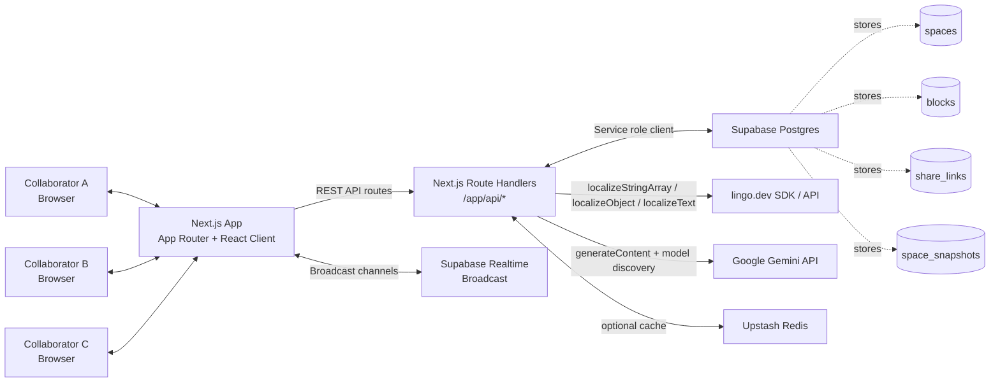
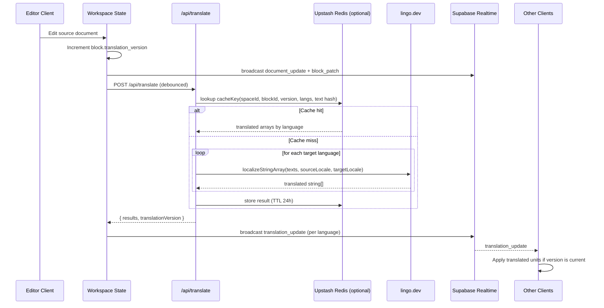
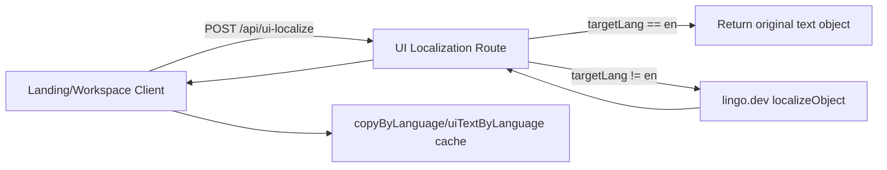
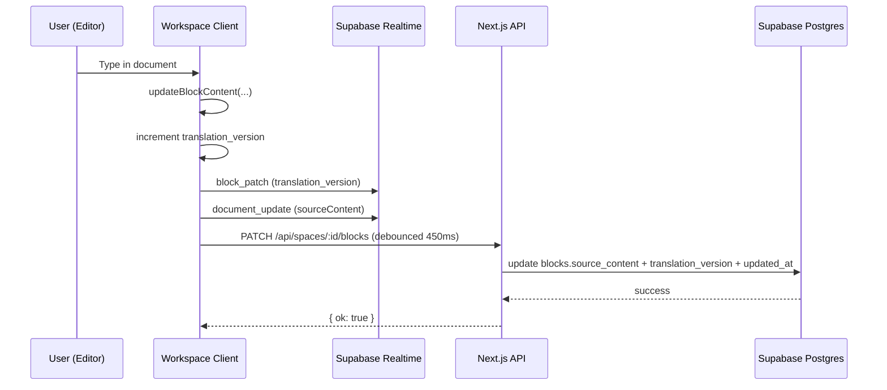
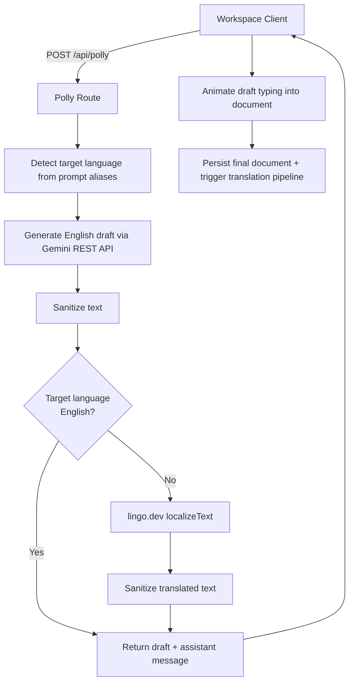

<p align="center">
  
</p>

<h1 align="center">Polyform</h1>
<p align="center"><strong>One workspace. Every language. Zero barriers.</strong></p>

Polyform is a real-time multilingual collaboration app built with Next.js, Supabase Realtime/Postgres, lingo.dev, and Gemini. The core design is source-first: collaborators edit a single canonical document source, while each participant can read the same document in their own language through live, versioned translations.

This repository currently implements a hackathon-grade but production-leaning system with:
- a polished landing page and product/demo/architecture pages,
- an `/app` dashboard for creating and managing spaces,
- a document-only collaborative workspace (`Polly Doc`),
- live share links and immutable snapshots,
- `lingo.dev` powered content + UI localization,
- and a Gemini-powered drafting assistant (`Polly`) with optional speech input.

## Table of Contents
- [What Polyform Does](#what-polyform-does)
- [Architecture Overview](#architecture-overview)
- [How lingo.dev Works in Polyform (Detailed)](#how-lingodev-works-in-polyform-detailed)
- [Realtime Collaboration System](#realtime-collaboration-system)
- [Polly AI Assistant System (Gemini + lingo.dev)](#polly-ai-assistant-system-gemini--lingodev)
- [Frontend Route Map](#frontend-route-map)
- [API Reference](#api-reference)
- [Data Model and Supabase Schema](#data-model-and-supabase-schema)
- [Project Structure](#project-structure)
- [Environment Variables](#environment-variables)
- [Local Development Setup](#local-development-setup)
- [Database Setup (Supabase)](#database-setup-supabase)
- [Testing and Quality Checks](#testing-and-quality-checks)
- [Security and Auth Status (Important)](#security-and-auth-status-important)
- [Troubleshooting](#troubleshooting)
- [Known Limits](#known-limits)
- [Roadmap / Recommended Next Steps](#roadmap--recommended-next-steps)

## What Polyform Does
Polyform is designed for multilingual collaboration without forcing everyone into a shared UI language or shared reading language.

### Core product behavior
1. A user creates a space (`Polly Doc`) in `/app`.
2. The system creates a `space` row plus one default `document` block in Supabase.
3. Collaborators open the same space link (edit/view/snapshot).
4. Everyone types into the same canonical source content.
5. The client extracts translatable text units from that source.
6. `lingo.dev` translates those units for active collaborator languages.
7. Translations are versioned and rendered per viewer language in real time.
8. Supabase Realtime broadcast channels synchronize presence, source updates, and translation updates.

### What is implemented right now
- Document-only collaboration block (`document`)
- Live presence (cursor position + user name + color + selected language)
- Share links (edit + view token links)
- Snapshots (immutable point-in-time payload stored in DB)
- Workspace UI localization using `lingo.dev`
- Content translation using `lingo.dev`
- Polly drafting assistant using Gemini, with optional post-translation through `lingo.dev`
- Browser speech-to-text input for Polly (Web Speech API when available)
- Landing page ElevenLabs ConvAI widget embed (web component loaded from `unpkg`)

## Architecture Overview
Polyform is a Next.js App Router app with client-heavy realtime collaboration behavior and server API routes for persistence, translation, localization, and AI generation.

### High-level system diagram


### Runtime responsibilities (by layer)
- `Browser / React client`
  - renders dashboard + workspace + marketing pages
  - manages source content, translation state, presence state, and UI localization state
  - debounces persistence and translation requests
  - connects to Supabase Realtime broadcast channel per space
- `Next.js route handlers`
  - create/read/update/delete spaces and blocks
  - create share links and snapshots
  - call `lingo.dev` for content and UI localization
  - call Gemini REST API for Polly drafting and optionally translate the draft with `lingo.dev`
- `Supabase`
  - Postgres data store for spaces/blocks/share links/snapshots
  - Realtime broadcast transport between clients
- `lingo.dev`
  - content translation (`localizeStringArray`)
  - UI object localization (`localizeObject`)
  - Polly draft translation (`localizeText`)
- `Upstash Redis` (optional)
  - 24h cache for translation API responses

## How lingo.dev Works in Polyform (Detailed)
`lingo.dev` is not a single feature in this app. It is used in three distinct pipelines:

1. Document content translation (`/api/translate`)
2. UI copy localization (`/api/ui-localize`)
3. Polly AI draft translation (`/api/polly`)

### 1) Document content translation pipeline (core collaboration path)
This is the most important system path.

#### Why the app uses a source-first model
The workspace stores one canonical source document in `blocks.source_content`. It does not persist a separate translated copy per language in the database. This avoids drift, merge ambiguity, and language-to-language conflicts.

Instead, the client maintains an in-memory translation map keyed by:
- `blockId`
- `language`
- `translationVersion`

If a translation is older than the current block version, it is ignored and the UI falls back to source content until fresh translations arrive.

#### Content translation sequence diagram (lingo.dev path)


#### How text is extracted and reapplied
For the `document` block type:
- `extractTranslatableUnits(...)` returns `content.paragraphs[]`
- `applyTranslatedUnits(...)` merges translated paragraph strings back into the document content while preserving other fields (e.g. formatting)

This preserves structure while translating only translatable text units.

#### Translation request payload (client -> server)
The workspace sends:
- `spaceId`
- `blockId`
- `texts: string[]`
- `sourceLang`
- `targetLangs: string[]`
- `translationVersion`

#### Cache strategy in `/api/translate`
The server builds a cache key using:
- `spaceId`
- `blockId`
- `translationVersion`
- `sourceLang`
- SHA1 of sorted `targetLangs`
- SHA1 of the concatenated text units

This means a cache hit is safe only when:
- the exact source text units match,
- the exact target language set matches,
- and the block version matches.

#### Why this design is reliable for live collaboration
- Source content remains authoritative.
- Translations are treated as derived views.
- Version checks suppress stale translations.
- Collaborator languages are discovered dynamically from live presence.
- Translation results can be shared over Realtime to avoid redundant client requests.

### 2) UI localization pipeline (`/api/ui-localize`)
Polyform localizes UI copy objects (landing and workspace text labels) separately from document content.

#### How it works
- Client selects a language.
- If localized UI copy is not already in client state, the client posts a copy object to `/api/ui-localize`.
- The API route validates payload via `zod`.
- For `en`, the route returns the original object directly (fast path, no external call).
- For non-English targets, the route calls `lingo.dev` `localizeObject(...)`.
- The client caches the localized copy object in component state by language.

#### UI localization diagram


### 3) Polly draft translation pipeline (`/api/polly`)
Polly generates a draft in English first (Gemini), then optionally translates the result into the target language detected from the user prompt via `lingo.dev`.

This keeps generation style/structure controlled in a consistent source language, then localizes afterward.

#### Polly language handling logic
- Prompt text is scanned for language aliases (e.g. English, German, French, Spanish, Portuguese, Japanese, Korean, Chinese).
- If no language is detected, target defaults to English.
- Gemini produces an English draft.
- If target is not English, `lingo.dev localizeText(...)` translates the draft.
- The response returns:
  - `assistantText`
  - `draftText`
  - `targetLanguageCode`
  - `targetLanguageLabel`
  - `center` (if prompt asks for centered content)

## Realtime Collaboration System
Polyform uses Supabase Realtime broadcast channels as an application-level event bus.

### Channel model
Each workspace connects to a channel named:
- `space:{spaceId}`

Broadcast config is set to:
- `self: false`
- `ack: false`

### Broadcast event types
| Event | Purpose | Payload highlights |
|---|---|---|
| `cursor_update` | live presence cursor and identity | `sessionId`, `displayName`, `language`, `color`, `cursorPosition`, `lastSeen` |
| `block_patch` | lightweight metadata patch | block `id`, `translation_version`, `universal` |
| `document_update` | canonical source update sync | `blockId`, `translationVersion`, `sourceContent`, `sessionId` |
| `translation_update` | translated unit updates | `blockId`, `translationVersion`, `language`, `texts[]` |

### Client state synchronization strategy
The workspace keeps multiple state layers:
- `blocks`: persisted block records + current source content
- `sourceById`: canonical source content per block (fast lookup)
- `translations`: derived translations per block/language/version
- `presenceById`: collaborator presence keyed by sessionId
- `translationPending`: per-block translation request state

### Edit + persist + translate timing behavior
- Presence broadcast throttle: `80ms`
- Translation debounce: `180ms`
- Block persistence debounce (`PATCH /api/spaces/:spaceId/blocks`): `450ms`

This separates:
- fast local UX,
- low-latency collaboration sync,
- and slightly delayed persistence/translation calls.

### Detailed edit flow (system behavior)


### Share links and snapshots
The workspace can generate 3 links in parallel:
- live edit link (`/api/spaces/:spaceId/share` mode `edit`)
- live view link (`/api/spaces/:spaceId/share` mode `view`)
- snapshot link (`/api/spaces/:spaceId/snapshot`)

Snapshot links point to immutable stored payloads and always open read-only.

## Polly AI Assistant System (Gemini + lingo.dev)
Polly is a server-assisted drafting workflow, not an in-browser LLM.

### What Polly does
- accepts a user prompt + optional current document text context
- generates a polished draft using Gemini via Google REST API
- optionally translates the final draft via `lingo.dev`
- returns structured response for the workspace UI
- animates the draft into the document client-side

### Gemini model resolution behavior (resilient fallback)
The Polly route:
1. Reads configured model from `GEMINI_MODEL`
2. Calls Google model listing API to discover available `generateContent` models
3. Builds an ordered candidate list from:
   - configured model
   - preferred fallback models
   - discovered models
4. Tries models in order until generation succeeds

This improves reliability across quota/model availability differences.

### Polly output normalization
Both Gemini output and translated output are sanitized to remove/normalize:
- `**`
- `#`
- em dash variants (normalized)
- excessive newlines

### Client-side drafting animation
The workspace animates the returned draft by:
- tokenizing text into word-ish chunks
- appending ~6 tokens every `28ms`
- updating the document block repeatedly
- persisting + translating only on final frame (to reduce churn)

### Polly architecture diagram


## Frontend Route Map
### App Router pages
| Route | Purpose |
|---|---|
| `/` | Landing page (`components/landing/landing-page.tsx`) |
| `/product` | Marketing product page |
| `/architecture` | Marketing architecture explainer page |
| `/demo` | Marketing demo page |
| `/app` | Dashboard for creating/listing/managing spaces |
| `/space/[spaceId]` | Workspace page (edit or view via query params) |
| `/space/[spaceId]/view` | Explicit view-only wrapper |
| `/space/[spaceId]/snapshot/[snapshotId]` | Snapshot viewer (read-only) |

### Workspace mode resolution
`/space/[spaceId]` accepts:
- `?mode=edit|view`
- `?token=<share-token>`

The API can override requested mode based on the share token's stored mode.

## API Reference
### Space and document APIs
| Route | Method | Purpose | Notes |
|---|---|---|---|
| `/api/spaces` | `GET` | List recent spaces | Returns up to 20 spaces ordered by `updated_at desc` |
| `/api/spaces` | `POST` | Create a space + default blocks | Creates space row and seeded document block |
| `/api/spaces/[spaceId]` | `GET` | Load space and blocks | Optional share token validation; returns `accessMode` |
| `/api/spaces/[spaceId]` | `PATCH` | Update space metadata | Supports title + `shareModeDefault` |
| `/api/spaces/[spaceId]` | `DELETE` | Delete space | Cascades to blocks/share links/snapshots via FK |
| `/api/spaces/[spaceId]/blocks` | `PATCH` | Persist block updates | Loops through block patches and updates each block |
| `/api/spaces/[spaceId]/share` | `POST` | Create share token link | Generates UUID-based token (hyphens removed) |
| `/api/spaces/[spaceId]/snapshot` | `POST` | Create immutable snapshot | Stores `{ space, blocks }` JSON payload in `space_snapshots` |
| `/api/snapshots/[snapshotId]` | `GET` | Fetch snapshot payload | Used by snapshot page |

### Localization and AI APIs
| Route | Method | Purpose | lingo.dev usage |
|---|---|---|---|
| `/api/translate` | `POST` | Translate document text units | `localizeStringArray(...)` |
| `/api/ui-localize` | `POST` | Localize UI copy object | `localizeObject(...)` |
| `/api/polly` | `POST` | Generate AI draft + optional translation | `localizeText(...)` for non-English target |

### Validation and error handling
- Localization and Polly routes use `zod` request validation.
- Most routes return JSON `{ error: string }` (or zod-derived error payloads) on failure.
- Translation/UI/Polly routes return `400` for validation failures and `500` for runtime failures.

## Data Model and Supabase Schema
Polyform currently uses a compact schema that supports collaboration, sharing, and snapshots.

### Tables (current migrations)
- `spaces`: top-level workspace metadata
- `blocks`: document blocks belonging to a space (currently only `document` type used)
- `share_links`: tokenized share access links (`edit` / `view`)
- `space_snapshots`: immutable stored payload snapshots
- `space_events`: schema exists but not actively written by current routes (reserved/extension point)

### ER diagram
```mermaid
erDiagram
  spaces ||--o{ blocks : contains
  spaces ||--o{ share_links : shares
  spaces ||--o{ space_snapshots : snapshots
  spaces ||--o{ space_events : events

  spaces {
    uuid id PK
    text title
    text source_language
    text share_mode_default
    timestamptz created_at
    timestamptz updated_at
  }

  blocks {
    uuid id PK
    uuid space_id FK
    text type
    float x
    float y
    float w
    float h
    text source_language
    int translation_version
    boolean universal
    jsonb source_content
    timestamptz created_at
    timestamptz updated_at
  }

  share_links {
    uuid id PK
    uuid space_id FK
    text mode
    text token UNIQUE
    timestamptz created_at
  }

  space_snapshots {
    uuid id PK
    uuid space_id FK
    jsonb payload
    timestamptz created_at
  }

  space_events {
    bigint id PK
    uuid space_id FK
    text kind
    jsonb payload
    timestamptz created_at
  }
```

### Document block content shape (current implementation)
`blocks.source_content` for the `document` type is JSON with this structure:

```ts
{
  paragraphs: string[];
  format?: {
    zoom?: number;
    fontFamily?: string;
    fontSize?: number;
    bold?: boolean;
    italic?: boolean;
    underline?: boolean;
    textType?: "normal";
    lineHeight?: number;
    align?: "left" | "center";
  };
}
```

### Realtime publication migration
A migration adds `spaces`, `blocks`, and `share_links` to the `supabase_realtime` publication if it exists.

Note: the current app primarily uses explicit broadcast channels (not row-level CDC subscriptions) for collaboration events.

## Project Structure
High-signal files and folders (trimmed):

```text
app/
  (marketing)/
    page.tsx                  # landing page
    product/page.tsx
    architecture/page.tsx
    demo/page.tsx
  app/page.tsx                # dashboard route (/app)
  space/[spaceId]/page.tsx    # workspace route with mode + token query params
  space/[spaceId]/view/page.tsx
  space/[spaceId]/snapshot/[snapshotId]/page.tsx
  api/
    spaces/...
    snapshots/...
    translate/route.ts        # lingo.dev content translation
    ui-localize/route.ts      # lingo.dev UI localization
    polly/route.ts            # Gemini draft + optional lingo.dev translation

components/
  dashboard/dashboard-page.tsx
  landing/landing-page.tsx
  space/workspace.tsx         # core collaboration orchestration
  space/share-modal.tsx
  space/language-modal.tsx
  blocks/document-block.tsx
  blocks/translation-utils.ts

lib/
  env.ts                      # env parsing and aliases
  defaults.ts                 # supported languages + default block seed
  supabase/client.ts          # browser Supabase client (anon key)
  supabase/server.ts          # server Supabase client (service role)
  realtime/supabase-room-client.ts
  translation/cache.ts        # Upstash Redis optional translation cache
  utils.ts

supabase/migrations/
  202602170001_init.sql
  202602170002_enable_realtime.sql
  202602170003_remove_legacy_blocks.sql
  202602170004_document_only.sql

tests/
  translation-utils.test.ts
```

## Environment Variables
Copy `.env.example` to `.env.local` and fill values.

### Required for app boot / core features
| Variable | Required | Scope | Purpose |
|---|---|---|---|
| `NEXT_PUBLIC_APP_URL` | Yes (recommended) | Client + server | Base URL used in generated links |
| `NEXT_PUBLIC_SUPABASE_URL` | Yes | Client + server | Supabase project URL |
| `NEXT_PUBLIC_SUPABASE_ANON_KEY` | Yes (client features) | Client | Browser Supabase client (Realtime) |
| `SUPABASE_SERVICE_ROLE_KEY` | Yes | Server only | Server-side DB access in API routes |

### Required for localization and AI features
| Variable | Required | Scope | Purpose |
|---|---|---|---|
| `LINGO_API_KEY` | Yes for translation/localization | Server only | `lingo.dev` SDK auth |
| `LINGODOTDEV_API_KEY` | Alias | Server only | Accepted alias for `LINGO_API_KEY` |
| `GEMINI_API_KEY` | Yes for Polly | Server only | Google Gemini REST API auth |
| `GOOGLE_API_KEY` | Alias | Server only | Accepted alias for `GEMINI_API_KEY` |
| `GEMINI_MODEL` | Optional | Server only | Preferred Gemini model (defaults to `gemini-1.5-flash`) |

### Optional cache configuration
| Variable | Required | Scope | Purpose |
|---|---|---|---|
| `UPSTASH_REDIS_REST_URL` | Optional | Server only | Translation cache backend URL |
| `UPSTASH_REDIS_REST_TOKEN` | Optional | Server only | Translation cache backend token |

### Example `.env.local`
```env
NEXT_PUBLIC_APP_URL=http://localhost:3000
NEXT_PUBLIC_SUPABASE_URL=
NEXT_PUBLIC_SUPABASE_ANON_KEY=
SUPABASE_SERVICE_ROLE_KEY=
LINGO_API_KEY=
GEMINI_API_KEY=
GEMINI_MODEL=gemini-1.5-flash
UPSTASH_REDIS_REST_URL=
UPSTASH_REDIS_REST_TOKEN=
```

## Local Development Setup
### Prerequisites
- Node.js 18+ (Node 20+ recommended)
- npm
- Supabase project (URL + anon key + service role key)
- `lingo.dev` API key
- Gemini API key (for Polly features)
- Optional: Upstash Redis instance for translation caching

### Install and run
```bash
npm install
npm run dev
```

### Useful local URLs
- Landing: `http://localhost:3000/`
- Dashboard: `http://localhost:3000/app`
- Architecture page: `http://localhost:3000/architecture`

## Database Setup (Supabase)
### Migration order (current repository)
Run in this order:
1. `202602170001_init.sql`
2. `202602170002_enable_realtime.sql`
3. `202602170003_remove_legacy_blocks.sql`
4. `202602170004_document_only.sql`

### Using Supabase CLI
```bash
supabase link --project-ref <your-project-ref>
supabase db push
```

### What the migrations do (summary)
- `202602170001_init.sql`
  - creates core tables and indexes
- `202602170002_enable_realtime.sql`
  - adds selected tables to `supabase_realtime` publication if present
- `202602170003_remove_legacy_blocks.sql`
  - removes non-current block types except `document`/`table` (transition cleanup)
- `202602170004_document_only.sql`
  - enforces current document-only scope in existing data

## Testing and Quality Checks
### Scripts
```bash
npm run typecheck   # tsc --noEmit
npm run lint        # next lint
npm test            # vitest run
npm run test:watch  # vitest
```

### Current automated test coverage (what exists)
The repo currently includes a focused test for translation unit extraction/reapplication:
- `tests/translation-utils.test.ts`

This validates that document paragraph extraction and translated paragraph reapplication preserve non-translated fields (e.g. formatting).

## Security and Auth Status (Important)
This section is intentionally explicit.

### Current state
Polyform currently has **no real user authentication/login flow implemented**.

What exists:
- Supabase is used for Postgres + Realtime transport.
- Server API routes use a Supabase **service role key**.
- Share links generate tokens and can control the UI's requested access mode when loading a space.

What does not exist yet:
- Supabase Auth session login (`signIn`, `getUser`, session cookies)
- per-user ownership checks
- row-level security (RLS) based enforcement in route handlers
- server-side authorization checks for write routes (beyond basic route params)

### Practical implication
This build is appropriate for:
- demos
- hackathons
- local testing

It is **not production-secure** as-is for multi-tenant/public deployment.

### Recommended hardening path
1. Add Supabase Auth (email/OAuth) with server session validation.
2. Replace service-role access in user-facing routes with user-scoped auth clients where possible.
3. Add RLS policies on `spaces`, `blocks`, `share_links`, and `space_snapshots`.
4. Enforce write access on server routes (not only client-side `readOnly` mode).
5. Add audit/event logging (the `space_events` table is a natural starting point).

## Troubleshooting
### `Missing required env var: NEXT_PUBLIC_SUPABASE_URL`
- Add the variable to `.env.local`
- Restart the dev server

### `Missing required env var: SUPABASE_SERVICE_ROLE_KEY`
- Add a valid service role key from your Supabase project settings
- Restart the dev server

### Translation requests fail (`/api/translate` or `/api/ui-localize`)
- Verify `LINGO_API_KEY` (or `LINGODOTDEV_API_KEY`)
- Confirm outbound network access from the Next.js server
- If using Redis cache, ensure Upstash env vars are valid (cache is optional)

### Polly errors / Gemini model not found
- Verify `GEMINI_API_KEY` (or `GOOGLE_API_KEY`)
- Keep `GEMINI_MODEL` at the default if unsure
- The Polly route auto-tries fallback models, but quota/access restrictions can still fail requests

### Realtime feels inconsistent
- Confirm `NEXT_PUBLIC_SUPABASE_ANON_KEY` is set (browser client needs it)
- Check browser network connectivity / websocket stability
- Remember that translations are versioned and stale translations are intentionally ignored

## Roadmap / Recommended Next Steps
### High-impact product/system improvements
1. Implement Supabase Auth + RLS + server authorization checks.
2. Add ownership/collaborator membership model (`space_members`).
3. Persist selected translated outputs or translation job logs for analytics/debugging.
4. Add background translation jobs / retry queues for large documents.
5. Add conflict-aware collaborative editing (OT/CRDT) if moving beyond single-source last-write flows.
6. Expand block types beyond `document` (and update translation unit extraction per type).
7. Add observability (structured logs, request ids, API latency metrics, translation cache hit rates).
8. Add comprehensive tests for routes, workspace reducers/state, and share/snapshot flows.

## License
ISC (per `package.json`).

## Security Note
Do not commit real API keys. If any secrets were exposed, rotate them immediately in:
- Supabase
- lingo.dev
- Google Gemini
- Upstash
